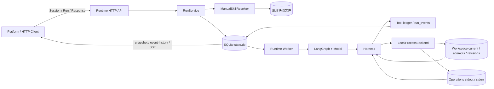

# Agent 流程与数据落点（As-Is）

日期：2026-09-14。范围：当前仓库中实际可运行的本地 Agent Runtime，而不是尚未部署的 PostgreSQL 生产实现。

本文回答三个问题：

1. Agent 流程每一步需要什么数据。
2. 数据在什么时点写入，哪些写入是同一事务。
3. 数据落在哪里，发生故障或下一轮运行时从哪里恢复。

权威实现来源：[RuntimeApp](../src/code_forge/runtime/app.py)、[SQLite Store](../src/code_forge/persistence/sqlite_store.py)、[WorkspaceStore](../src/code_forge/workspace/store.py)、[ManualSkillResolver](../src/code_forge/skills/manual_skill_resolver.py)、[LocalProcessBackend](../src/code_forge/execution/local_process_backend.py)、[LangGraph Harness](../src/code_forge/harness/langgraph_harness.py)。目标 PostgreSQL 结构仍以 [database.md](database.md) 和 [001_runtime.sql](../db/migrations/001_runtime.sql) 为准。

## 1. 结论摘要

当前数据分成四类载体：

| 载体 | 默认位置 | 当前保存的内容 | 是否可作为恢复事实 |
| --- | --- | --- | --- |
| SQLite 运行库 | `FORGE_RUNTIME_DIR/state.db`，默认 `.runtime/state.db` | Session、Message 到 Run 的映射、Attempt、工具账本、Session 级事件、配置快照、幂等键 | 是，当前进程重启后仍可读取 |
| Session 文件 | `<user_root>/sessions/<session_id>/` | `session.json` 逻辑绑定元数据和 `transcript-*.jsonl` 对话记录 | 是；SQLite 仍是权威状态，文件是用户根目录投影 |
| Tool Output | `<user_root>/tool-output/<session_id>/<run_id>/<operation_id>/` | 操作 stdin 输入、受限 stdout/stderr 日志与操作引用 | 是，绑定模式；legacy 仍使用 `.runtime/operations/` |
| Skill 快照 | 绑定模式为 `.runtime/skill-snapshots/<scope-digest>/<digest>/`；legacy 为 `.runtime/skill-snapshots/<digest>/` | 接受 Run 时固定下来的完整 Skill 包 | 是，已接受 Run 从快照读取，不读源目录 |
| Workspace 与操作文件 | 绑定模式使用 UserBinding `project_path` 和 `.forge/`；legacy 使用 `.runtime/workspace-store/`；日志在 `.runtime/operations/` | 当前文件、修订副本、manifest、完整受限日志 | 是，文件先保存；修订随后与数据库 CAS 关联 |
| Python/LangGraph 内存 | Worker 线程、`MemorySaver`、进程对象 | 当前图状态、消息列表、工具调用中间态、子进程句柄 | 否，Runtime 重启后丢失 |

最重要的时序结论：

- `POST /v1/create-session` 返回前，Workspace、Session、路径绑定和内部创建记录已经写入 SQLite；绑定模式下同时建立 `sessions/<session_id>/`、`config/`、`tool-output/`、`snapshots/` 用户目录。
- 每个 Skill 包在 Run 接受事务之前就已经复制到不可变快照目录；接受事务只保存引用、版本和 digest。
- `POST /v1/send-message` 返回首个 SSE 事件前，Message 对应的 Run 输入、配置快照、`QUEUED` 状态和首事件已经提交。
- Worker 领取 Message 时，Attempt、epoch、租约、`RUNNING` 状态和开始事件已经提交。
- 工具是在 `tool.prepared` 和 `tool.started` 落库之后才真正启动。
- 工具日志先持续写入文件；工具结束后，最多各 8192 字节的 stdout/stderr 才作为 `tool.output` 事件落库。
- 工作区文件内容先提交到文件系统，再写 `workspace_revisions` 并通过 Workspace lease/epoch 和父修订 CAS 更新 `workspaces.current_revision`，最后写 `workspace.committed`。
- 最终文本、`task_outcome` 和终态在同一个 SQLite 事务中写入；`run.finished` 与终态同时出现。
- 多轮上下文不是从 LangGraph checkpoint 恢复，而是从之前 Run 的 `runs.input` 和 `runs.output` 重新组装。

## 2. 总体数据流

图中的数据库是当前本地事实源。Platform 页面只走 HTTP/SSE，不直接读取 SQLite、Workspace 或 Skill 目录。

## 3. 逐流程数据落点

### S01 创建 Session

触发：`POST /v1/create-session`。

事务内写入：

- `workspaces`：按用户 Project 获取或创建 `workspace_id`；保存 `storage_root/user_rel_path/user_path/project_ref/project_path`，legacy 保存 `workspace:<id>`。
- `sessions`：Session、Workspace 映射、`thread_id=thread:<session_id>`、初始 `next_run_seq=1`、`next_event_seq=1`、`execution_epoch=0`。
- `session_requests`：内部生成的接受键、请求摘要和 `session_id`。

事务提交后，`AgentRuntime.create_session` 创建 UserBinding `project_path`（绑定模式）或 `workspace-store/current/<workspace_id>/`（legacy）。数据库记录先于目录出现；若进程在两步之间退出，目录会在后续访问时按需补建。

重复请求比较 `session_requests.request_fingerprint`；同键不同内容返回 `IDEMPOTENCY_CONFLICT`。同一 Project 的多个 Session 复用 Workspace，但各自维护独立 thread_id 和 Run 序号。

### S02 提交 Message 与固定 Skill

触发：`POST /v1/send-message`。

在数据库接受事务之前：

1. `RunService` 校验内部接受键、输入长度和 Session；Platform 不提供幂等键。
2. `ManualSkillResolver` 读取源 Skill，递归解析 `requires`。
3. Skill 根按 Run 固定：未传 `skill_paths` 时使用 `user_path/config/skills`，显式传入多个路径时只按给定顺序查找。
4. 完整 Skill 包复制到 user scope 隔离的不可变快照目录。
5. `RunSnapshot` 收集 UserBinding、有效 Skill 路径及来源、路径摘要、runtime/model/execution profile 和 Skill `name/version/digest/source_kind/source_path/bundle_ref`。

数据库接受事务内写入：

- `runs`：`workspace_id`、`input`、`agent_ref`、`execution_context`、完整 `config_snapshot`、`run_seq`、请求指纹、`QUEUED`、`state_version=0`、`next_event_seq=1` 和审计字段。
- `run_events`：内部 `run.accepted`，公开投影为 `message.accepted`；同时分配 Session 级 `session_seq`。
- `sessions.next_run_seq/next_event_seq`：分别增加 1，并更新 Session 审计字段。
- `sessions/<session_id>/transcript-000001.jsonl`：写入 `user` 记录；Run 正常结束后补写对应的 `assistant` 结果记录。

事务提交后 `send-message` 建立 SSE 并先发送 `message.accepted`。网络超时不承诺 exactly-once，Platform 先查询 Session 状态再决定后续动作。

若快照已复制但接受事务失败，快照目录可能成为无引用文件；当前没有清理器。

### S03 领取 Run

触发：后台 Worker 调用 `claim_next_run`。

同一事务内写入：

- `run_attempts`：新 Attempt、Session `epoch`、Workspace `workspace_epoch`、`worker_id`、`lease_until`、`heartbeat_at`、`workspace_base_revision`、`mount_spec_ref`、`working_directory_ref`。
- `sessions`：`active_run_id` 指向该 Run，`execution_epoch` 增加。
- `workspaces`：`active_attempt_id` 指向该 Attempt，`workspace_epoch` 增加，写入 lease/heartbeat。
- `runs`：`RUNNING`、`active_attempt_id`、`state_version+1`、`due_at=lease_until`。
- `run_events`：`run.started`，payload 包含 `attempt_id`。

`workspace_base_revision` 读取 `workspaces.current_revision`，首次执行可以为空，后续执行固定到上一有效修订。

现有领取逻辑选取 `QUEUED`、已到期、Session 无 active Run 且 Workspace 无 active Attempt 的任务；没有租约到期恢复、心跳续约或自动接管扫描。

### S04 准备执行与激活 Skill

Worker 拿到 Run 后：

- 绑定模式直接使用 UserBinding `project_path`；legacy 从 current 复制到 Attempt 目录。
- 从 `runs.config_snapshot.skills[].bundle_ref` 读取固定 Skill 快照。
- 每个激活 Skill 单独追加一条 `skill.activated` 事件。
- Skill 正文放入 System Prompt；正文和资源本身不复制进 SQLite。
- 从 `runs` 查询当前 Session 更早的 Run，用 `input` 和 `output` 重建对话历史。

因此，同一 Session 的连续轮次依赖 `runs.output` 持久化，而不依赖 LangGraph Checkpointer。历史超过上下文预算时只在本次运行内存中摘要，摘要不落库。

### S05 模型调用与消息

模型请求在内存中组装，包含：

- 固定 System Prompt。
- 活动 Skill 正文。
- 从历史 Run 重建并可能压缩的 user/assistant 消息。
- 本轮 `runs.input`。
- `execute_python`、`execute_command` 的工具 schema。

流式模型处理时：

- 每个 `message.delta` 都单独提交到 `run_events`，并更新 `runs.next_event_seq` 和 Run 审计字段。
- 模型回复完整后写 `message.completed`。
- 完整模型请求、隐藏推理和原始 Provider 响应不单独持久化。

LangGraph 图当前使用进程内 `MemorySaver`，且 `thread_id=attempt_id`。所以图 checkpoint 仅帮助当前进程内的节点循环，不能在 Runtime 重启后恢复，也不能直接承接下一轮 Run。

### S06 工具调用与进程执行

一次 Python/命令工具调用按以下顺序发生：

1. Harness 在内存中取得模型生成的 Python 或 shell 代码。
2. `prepare_tool` 事务写 `tool_executions(PREPARED)` 和 `tool.prepared`。
3. `start_tool` 事务把工具改为 `RUNNING` 并写 `tool.started`。
4. Harness 写 `skill.started`。
5. `LocalProcessBackend.submit` 在绑定模式创建 `<user_root>/tool-output/<session_id>/<run_id>/<operation_id>/`，legacy 模式继续使用 `operations/<operation_id>/`。
6. `input.txt` 先原子保存原始 stdin；Python 使用 `python3 -`、shell 使用 `/bin/bash -s` 从 stdin 执行，不把过程脚本写进 Workspace。
7. stdout/stderr 持续写入该操作目录下的 `stdout.log` 和 `stderr.log`；超时诊断也写入 `stderr.log`。

`tool_executions` 保存 `workspace_id`、`logical_call_key`、`tool_ref`、参数 digest、`input_ref`、`input_revision_id`、`result_revision_id`、执行 profile、状态和结果引用。`input_ref` 仍是本地引用字符串，不是集中存储的操作输入对象。

### S07 工作区提交

进程成功退出后，`LocalProcessBackend` 执行：

1. 比较执行根与当前 manifest 的文件清单。
2. 将执行根复制到不可变 revision 目录：绑定模式为 `<project_path>/.forge/revisions/<revision_id>/`，legacy 为 `workspace-store/revisions/<workspace_id>/<revision_id>/`。
3. 绑定模式不覆盖另一个 current 副本；`project_path` 本身是正式执行树，revision 保存可恢复副本。
4. 生成 manifest digest 和 changed paths。
5. Harness 在 Workspace lease/epoch 与父修订匹配时插入 `workspace_revisions`，CAS 更新 `workspaces.current_revision`。
6. Harness 读取日志，写最多各 8192 字节的 `tool.output` 事件，再写 `workspace.committed`。
7. `finish_tool` 更新 `tool_executions.status/result_ref/result_revision_id/error`，并写 `tool.finished` 或 `tool.unknown`。
8. Harness 写 `skill.finished`。

当前 `result_ref` 指向 stdout 日志文件，Revision 另由 `result_revision_id` 关联。`changed_paths` 已写入 workspace 事件。

当前文件事实同时落在文件系统和数据库：

- `workspace_revisions`：每次成功工具提交写入不可变修订。
- `workspaces.current_revision`：按 lease、epoch 和父修订 CAS 更新。
- `artifacts`：仍未从工具成果写入，文件 API 直接读取当前执行根。

### S08 正常完成

Harness 得到最终文本后：

1. 追加 `message.completed`。
2. 在一个事务中把 Run 更新为 `SUCCEEDED`。
3. 同事务写入 `task_outcome`、最终 `output`、`state_version+1` 和 `run.finished`。
4. 同事务结束 Attempt、清空 `runs.active_attempt_id` 和 `sessions.active_run_id`。

`SUCCEEDED` 只表示运行协议正常结束，`completed/partial/blocked` 才表达任务结果。模型错误、未配置模型或 Harness 异常走 `FAILED`，错误对象写入 `runs.error` 和 `run.finished`。

### S09 取消与回应

取消：

- `QUEUED` Run 会先写 `CANCELLING`/`run.cancel_requested`，再写 `CANCELLED`/`run.finished`。
- `RUNNING` Run 当前只可靠地写入 `CANCELLING`；Harness 在工具边界检查取消，但 `cancel_run` 尚未调用 `ExecutionBackend.cancel`，也没有最终的接管协程保证把运行中的 Run 写成 `CANCELLED`。
- 已终态取消是幂等读取，不新增事件。

回应：

- `respond_to_run` 已实现待决项消费、回应指纹、状态版本校验和恢复 `QUEUED` 的事务路径。
- 当前代码没有路径插入 `pending_responses`，也没有把 Run 转成 `WAITING_USER` 并保存 `pending_id`，所以澄清/恢复链路尚未端到端落地。

### S10 查询、SSE 与下一轮

以下接口只读 SQLite，不产生业务写入：

- Session/Run 列表与详情。
- Run snapshot。
- event-history。
- SSE `/events`，按 `run_events.seq` 增量读取。
- Workspace 文件列表和文本读取。

SSE 的事件不是独立通道：所有 `tool.*`、`message.*`、`skill.*`、`workspace.committed` 和 Run 状态事件都先进入 `run_events`，再被轮询并发送。

下一轮 Run 通过 `conversation_history` 读取同 Session 更早 Run 的 `input/output`。Workspace 通过新 Attempt 复制 current 来延续文件成果。

## 4. SQLite 表的实际角色

| 表 | 当前是否写入 | 主要数据 | 关键时点 |
| --- | --- | --- | --- |
| `workspaces` | 是 | Project 路径绑定、Workspace lease、current revision 指针 | Session 创建、领取执行、终态、修订发布 |
| `workspace_revisions` | 是 | 修订链、manifest digest/ref、不可变副本引用 | 每个成功工具提交后 |
| `sessions` | 是 | thread、Session 序号、epoch、active Run | Session 创建、领取/结束 |
| `session_requests` | 是 | Session 创建幂等键和指纹 | Session 创建事务 |
| `runs` | 是 | 输入、Workspace、快照、状态、结果、错误、事件水位 | 接受、领取、终态 |
| `run_attempts` | 是 | worker、Session/Workspace epoch、租约、工作区起点 | 领取、终态 |
| `tool_executions` | 是 | Workspace、逻辑调用、参数摘要、输入/结果修订、状态 | 工具准备、启动、结束 |
| `pending_responses` | 否 | 澄清/核验问题和回应 | 预留；缺写入路径 |
| `run_events` | 是 | 可回放事件、消息片段、工具/Skill 进展 | 流程每个可见节点 |
| `artifacts` | 否 | 成果引用、MIME、digest、provenance | 预留；文件结果当前通过 Workspace 文件接口读取 |

每次插入 `run_events` 都会在同一事务中增加 `runs.next_event_seq`，并更新 Run 的 `date_updated/updated_by`。因此高频 `message.delta` 也会持续更新 Run 审计时间。

## 5. 文件系统数据字典

| 位置 | 何时产生 | 内容 | 何时读取 |
| --- | --- | --- | --- |
| `.runtime/state.db` | Runtime 启动和业务写入 | 全部运行事实与事件 | API、Worker、恢复和上下文组装 |
| `skill-snapshots/<scope-digest>/<digest>/` | Run 接受前解析 Skill | SKILL.md 和全部支持文件 | Run 激活 Skill 时 |
| UserBinding `project_path` | Session 创建、工具执行 | 当前用户 Project 正式文件及 `.forge` 元数据 | 文件 API、下一轮 Run |
| `<user_root>/sessions/<session_id>/` | Session 创建或启动回填 | `session.json` 和 JSONL transcript | 会话恢复、审计和用户目录检查 |
| `<user_root>/tool-output/<session_id>/<run_id>/` | 工具执行 | 每次操作的 stdin、stdout/stderr 与引用 | Harness、诊断 |
| `<project_path>/.forge/revisions/<revision_id>/` | 工具成功提交后 | 该次提交的完整文件副本 | 恢复和审计 |
| `.runtime/workspace-store/current/<workspace_id>/` | legacy Session 创建、工具成功提交 | 旧模式当前正式文件及 manifest | 兼容测试 |
| `.runtime/operations/<operation_id>/input.txt` | 子进程启动前 | Python/命令的原始 stdin | Harness、诊断 |
| `.runtime/operations/<operation_id>/stdout.log` | 子进程运行时 | 有界 stdout | Harness 读取、`result_ref` 指向 |
| `.runtime/operations/<operation_id>/stderr.log` | 子进程运行时 | 有界 stderr | Harness 读取和错误摘要 |

Skill 源目录 `skills/` 是编辑源，不是已接受 Run 的运行源。Run 接受后只使用 digest 对应的快照目录。

## 6. 内存数据和外部数据流

只在内存中存在、重启后丢失的数据：

- SQLite 连接和线程锁。
- `LocalProcessBackend._operations` 中的进程对象、退出码和运行状态。
- LangGraph `MemorySaver` 中的图 checkpoint 和当前消息列表。
- 上下文压缩后的摘要。
- 正在流式接收但尚未写成事件的模型片段。

会发送到外部模型的数据：

- 当前 Run 输入。
- 活动 Skill 正文。
- 之前 Run 的 user/assistant 文本。
- 工具返回给模型的有界 stdout/stderr 文本。

当前不会主动写入数据库或公开事件的敏感数据包括模型 API Key 和 Provider 原始响应。需要注意，`LocalProcessBackend` 的环境清理列表目前没有移除 `DEEPSEEK_API_KEY`，子进程环境隔离仍需在真实安全验收中单独处理。

## 7. 当前已知差距

以下内容必须按“当前实现现状”理解，不能当作 PostgreSQL 生产能力：

1. 本地适配器使用 SQLite，生产 PostgreSQL Repository、事务和迁移运行仍未落地。
2. LangGraph 使用 `MemorySaver`，没有持久 Checkpointer；恢复只能依赖 SQLite 业务事实重新组装，不能继续原图节点。
3. `artifacts` 尚未形成真实写入链；Workspace revision 已接入 SQLite 和事件链。
4. `tool_executions.input_ref` 目前只是字符串引用，`process_ref`、`external_operation_ref`、`checkpoint_ref` 未写入。
5. `tool.output` 在工具结束后批量落库，不是实时同步每个日志分片。
6. `pending_responses` 有读写接口，但没有创建待决项的流程，澄清恢复尚未闭环。
7. 运行中取消不会调用底层进程取消，也没有独立的取消收尾协程。
8. Workspace lease/epoch 已阻止旧 Attempt 发布修订，但没有心跳续约、租约超时扫描和自动接管。
9. legacy 与 UserBinding 项目路径同时存在；生产 PostgreSQL 必须先执行真实迁移和并发验证。
10. User Root 已创建 `snapshots/` 目录，但每个 Run 的执行前快照及其 PostgreSQL 元数据表尚未落地；当前文件恢复事实仍由 `workspace_revisions` 承担。

## 8. 恢复时各事实从哪里取

| 要恢复的问题 | 当前事实来源 | 当前限制 |
| --- | --- | --- |
| 用户提交过什么 | `runs.input/config_snapshot` | 可读取 |
| 请求是否重复 | `runs`/`session_requests` 唯一键和指纹 | 路径可用 |
| 当前由谁执行 | `run_attempts`、`sessions.active_run_id`、`runs.active_attempt_id` | 没有真实租约回收 |
| 工具计划做了什么 | `tool_executions` | PID 和外部句柄没有持久化 |
| 工具实际输出是什么 | `run_events.tool.output` 和 operations 日志 | DB 只截取 8 KiB/流 |
| 文件成果在哪里 | `project_path`、`workspace_revisions/manifests` 和 `workspace.committed` | legacy 与绑定路径两套适配 |
| 模型最后说了什么 | `runs.output` 和 `message.completed` | 流中间态只有 delta 事件 |
| 如何继续下一轮 | `runs.input/output` + Workspace current | 不依赖 LangGraph checkpoint |

这份 As-Is 文档描述的是当前代码行为。任何表结构、持久化时刻、恢复语义或事务边界变化，都必须同步更新本文、[database.md](database.md)、[agent-workflow.md](agent-workflow.md) 和相关 TC。
