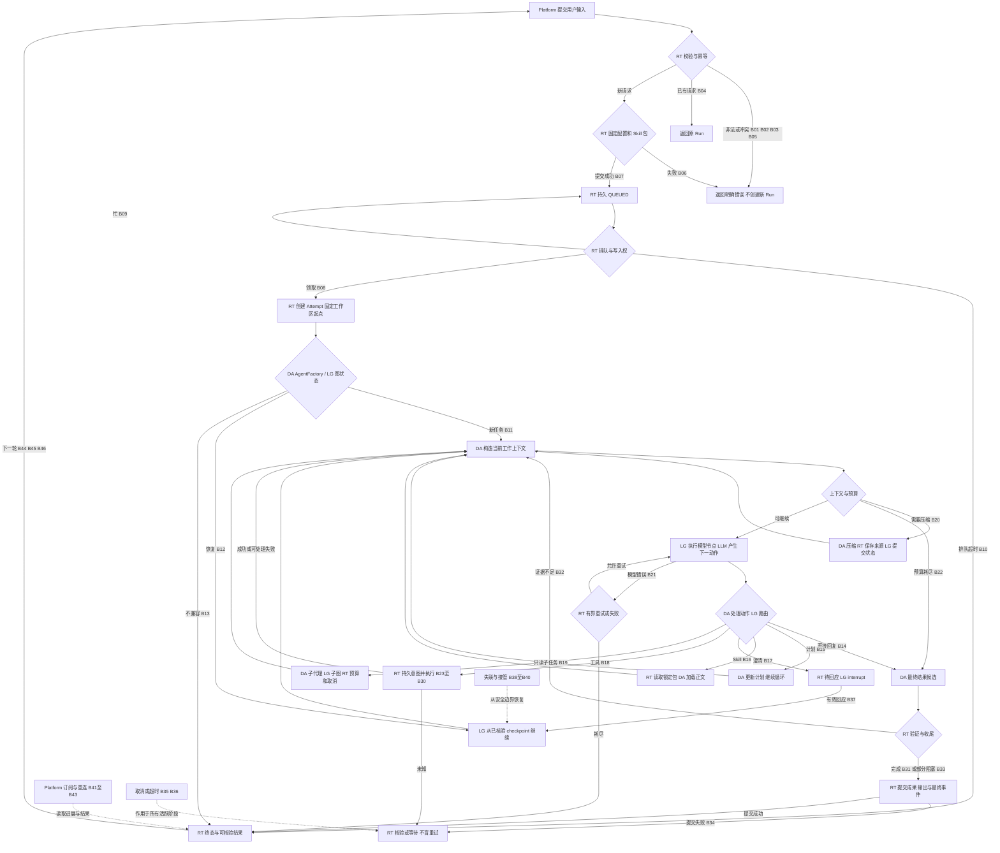
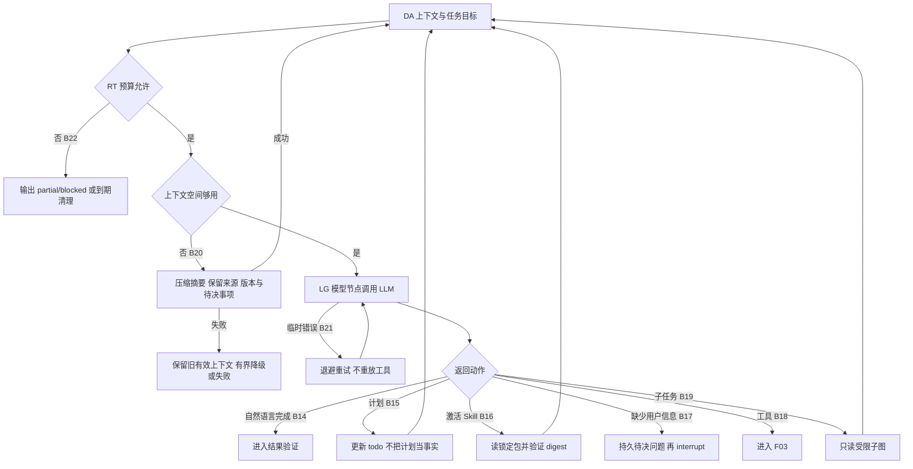
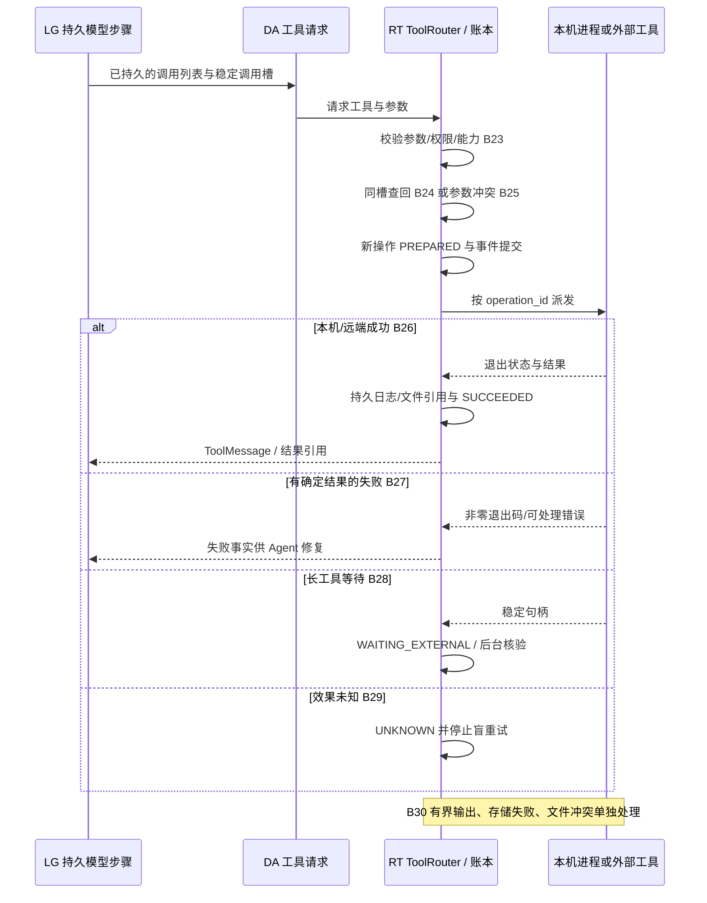
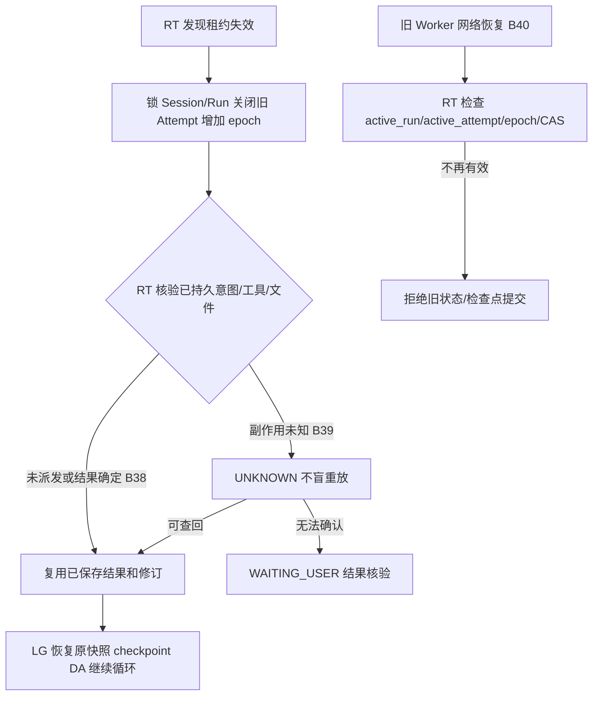

# Agent 全流程、分支与框架职责

版本：0.4，日期：2026-09-10。本文描述一期实际要实现的 Agent 工作过程。节点编号 B01—B48 对应 [测试用例](testing/agent-workflow-cases.md)；机器可读定义见 [测试注册表](testing/agent-workflow-cases.json)。这些是待实现的流程契约，不代表集成测试已通过。

## 1. 四种角色各自做什么

| 角色 | 在流程中的实际工作 | 本项目接入点 | 不自动提供的保证 |
| --- | --- | --- | --- |
| LLM / ModelAdapter | 根据当前上下文产生回复、工具请求、澄清问题或子任务意图 | 模型节点调用，通过配置选择真实模型 | 不调度集群、不直接执行 Python，不以文字声称代替测试证据 |
| Deep Agents（DA） | 用 Agent Harness 组织模型—工具反馈循环，接入计划、文件、Skill、上下文管理和子任务能力 | AgentFactory 组装、受控 Backend/Middleware、SkillLoader、工具与子任务配置 | 不自动提供我们的 Run 幂等、任务队列、企业权限和外部 exactly-once |
| LangGraph（LG） | 执行 DA 构建的图，按图边推进模型/工具/子图节点，维护状态、checkpoint/pending writes、interrupt/resume 与流式执行入口 | Worker 启动图、Checkpointer、图任务/调用槽、事件适配 | 持久状态不等于唯一 Worker、进程恢复或外部副作用已处理 |
| 自研 Runtime（RT） | 接受与排队、快照、租约、唯一 writer、工具账本、真实子进程、超时取消、数据库/文件提交、公开事件 | RunService、Scheduler、ToolRouter、ExecutionBackend、WorkspaceStore、Reconciler、EventAdapter | LocalProcessBackend 是本机进程，不能冒充沙箱；集群保证需要实际验收 |

DA 和 LG 是 Runtime 进程里的库。**DA 组织 Agent 怎么工作，LG 驱动这张图及其持久状态，RT 管一次任务在服务中如何可靠地运行。**三者不是串联的三个远程服务。

官方依据：[Deep Agents overview](https://docs.langchain.com/oss/python/deepagents/overview)、[Customization](https://docs.langchain.com/oss/python/deepagents/customization)、[LangGraph Checkpointers](https://docs.langchain.com/oss/python/langgraph/checkpointers)、[Interrupts](https://docs.langchain.com/oss/python/langgraph/interrupts)。以下节点/业务分支是本项目设计，不是要求框架存在这些同名内置节点。计划等能力是否默认启用取决于锁定版本，AgentFactory 必须显式配置并验证。

## 2. 完整工作流程总图

图中的“循环”是 LG 驱动的 DA 图内部模型/工具循环。RT 的队列循环只负责找可运行 Run，不应另写一套模型调用循环。预算或取消优先于再次发起工具；简单对话无需强制经过计划、Skill、Python 或子任务。

## 3. F01：接受与排队（B01—B10）

输入为受信 ExecutionContext、Session ID、用户 input、Agent/Skill 绑定和幂等键。RT 负责此阶段，DA/LG 尚未执行推理。

| 分支 | 判断与动作 | 状态/持久结果 |
| --- | --- | --- |
| B01 | schema/输入长度/幂等键不合法 | 返回 INVALID_REQUEST，不接受新 Run |
| B02 | 授权端口拒绝；一期默认 allow，仅用拒绝替身测扩展 | CAPABILITY_DENIED；不能解析/执行工具 |
| B03 | Session 不存在或作用域不匹配 | SESSION_NOT_FOUND；不泄露其他 scope |
| B04 | 同键同规范化摘要 | 返回原 Run，不重新读取已变化的 Skill |
| B05 | 同键不同摘要 | IDEMPOTENCY_CONFLICT，不自动换键 |
| B06 | Skill 缺失、包不合法、不兼容或快照落盘失败 | SKILL_NOT_FOUND/SKILL_INCOMPATIBLE/DEPENDENCY_UNAVAILABLE；不返回 202 |
| B07 | 接受事务提交 | 输入/快照/QUEUED/接受事件同事务；新增审计字段写入 |
| B08 | 队首且无冲突 writer | 锁 Session/Run，分配 epoch/Attempt/工作区起点，RUNNING |
| B09 | Session 有活跃/等待主 Run 或资源暂不足 | 保持 QUEUED，有限轮询/退避，无模型调用 |
| B10 | 排队超过期限或执行前配置不可继续 | 分别 TIMED_OUT/FAILED；终态事件后释放队列归属 |

没有条件索引兜底时，B08/B09 必须以 Session.active_run_id、Run.active_attempt_id、行锁和 CAS 作为唯一归属依据。不能用 `SELECT status='RUNNING'` 后无锁启动。

## 4. F02：组装图、上下文与 Agent 循环（B11—B22）

B11 是新 Run：RT 提供已锁定快照、可用工具和当前 Workspace；DA 组装 Harness；LG 使用当前 Session Thread 继续有效历史。B12 是原 Run 恢复：先完成 F06 核验，再由 LG 恢复 checkpoint，不能把原 input 当新消息追加一次。B13 是图/模型配置或 checkpoint 不兼容：按批准的原版本执行，确实不可用则有界等待/FAILED，不能忽略 checkpoint 从头开始。

- B14：纯问答允许直接完成，不强制调用任何工具；输出仍经过 F04 验证与持久化。
- B15：计划更新可多次发生；只有证据支持才完成验证项，不能仅更新 todo 就报告任务已完成。
- B16：模型选择的是冻结候选内的 Skill，RT 提供包字节，DA 将指令加入上下文；越过候选、digest 不符和撤销均明确拒绝。源目录改动不影响旧 Run。
- B17：缺少业务必要信息时创建 clarification 待回应项，RT 转 WAITING_USER，LG interrupt。普通默认授权不触发审批。恢复节点可重入，副作用不能裸放在 interrupt 之前。
- B18：模型请求工具不等于工具已经执行；先完成持久计划和 RT 执行校验。
- B19：只读 Explore/Review 子任务继承收窄的能力、固定版本及父级预算；LG 子图独立状态；RT 处理超时/取消和结构化结果，子失败要返回可处理事实，禁止无限递归。
- B20：压缩不创建新产品 Run，不丢失当前目标、用户限制、来源、未完成工作与 Skill 版本；失败不能用空上下文继续执行写操作。
- B21：模型请求失败与工具失败是两条路径。429/临时超时按配置重试，同一步重试不得重复提交工具；无配置/不兼容返回明确错误，耗尽后 FAILED。
- B22：每次模型/工具派发前检查步数/时间等预算；达到上限停止新工作。保留已完成证据返回 partial/blocked；总时限触发 F05 清理，不能循环续命。

### 动作分流必须依据结构化结果

| 模型/框架输出 | 分流规则 |
| --- | --- |
| 同时有文字和 tool_calls | 文字可流式展示，但先执行工具；不能把临时文字当最终完成 |
| 仅最终回复候选 | 进入F04验证；Budget耗尽后的候选只能如实partial/blocked，不能循环要求继续验证 |
| 澄清 | 显式注册 request_clarification 工具/适配动作，持久化pending后interrupt；禁止靠问号或自然语言关键词直接修改Run状态 |
| 计划/Skill | 使用锁定版本框架工具或适配动作；对外是相同Run中的进展，不创建新的产品Run |
| 子任务 | 一期记为父Run的tool_executions操作，tool_ref区分Explore/Review，LG子图用独立namespace；公开进展复用tool.*，不新增未定义的子Run协议 |

配置和运行版本由实现者锁定并记录证据。本图不要求实现一个与Deep Agents并行的手写switch推理引擎；动作分类应挂接到其真实模型/工具节点与Middleware。

## 5. F03：工具、Python、外部数据执行（B23—B30）

B23 无效参数/未注册工具/能力拒绝作为结构化工具错误返回当前图，允许 Agent 在现有权限内重新规划；未执行操作不得标工具成功。永久运行配置问题可按 B13 结束。

B24 已成功操作直接返回持久结果；运行中操作附着到原句柄；未知操作进入核验。B25 相同逻辑槽不同参数是冲突，不覆盖旧记录。Agent 根据明确失败修复后的新命令属于新的逻辑槽；不能给未知原操作换 ID 重跑。

B26 本机 Python 在子进程执行。ToolRouter 记录状态，ExecutionBackend 管进程组/日志/时限，WorkspaceStore 提交文件，LG 保存返回的图状态，DA 再将反馈交给模型。测试是工具的真实退出和报告，不是模型自己验证自己。

B27 子进程正常结束但退出码非零，工具 FAILED 而 Run 通常仍 RUNNING；DA 可以读取错误、修改代码并用新逻辑槽再测。持续失败超过预算则输出 partial/blocked。单操作超时在已核验进程结束后也可作为明确工具失败处理。

B28 适用于异步 SQL/长构建等：持久句柄后挂起。轻量短调用可保持 RUNNING 协程，不把每一次网络等待强行改为 WAITING_EXTERNAL。回调/轮询使原 Run 可恢复，不直接启动第二个图执行者。

B29 远端成功回包丢失、Runtime 中断或本机进程尚无法核验都属于效果未知。进入账本 UNKNOWN；模型不得根据“异常”推断操作没发生。恢复规则见 F06。

B30 工具输出溢出要有截断标记与限额内日志，不能堵住心跳；文件冲突不覆盖；存储失败不确认结果成功。结果已经落盘、图 checkpoint 尚未提交时，恢复复用结果而不是重跑工具。

## 6. F04：验证、收尾和结果（B31—B34）

| 分支 | 判断 | 处理 |
| --- | --- | --- |
| B31 | 目标完成，有与当前代码/数据版本对应的执行证据 | 提交 SUCCEEDED + completed；message.completed / run.finished 与成果引用可靠保存 |
| B32 | 还需要测试、证据过期、工具或子任务未结束，且预算允许继续 | 回到当前 Agent 图继续；预算不足转B33，不能无限收尾循环或提前声称完成 |
| B33 | 已完成一部分，或确有环境/数据限制且无法继续 | 如实保存 SUCCEEDED + partial/blocked，说明剩余工作与证据；不是假测试通过 |
| B34 | 最终回复/产物/数据库提交失败 | 保留最终候选，重试提交/对账；不重新推理并重放写工具，不先发布完成事件 |

LG 图到 END 只是图执行结束；RT 还必须完成产品 Run 的提交与资源收尾。反过来，Platform 渲染出一段文本也不能把 Run 写为完成。

## 7. F05：取消、超时、回应（B35—B37、B47—B48）

B35 用户取消对 QUEUED/RUNNING/WAITING/RECOVERING 生效：RT 原子转 CANCELLING、停止新派发、通知 LG/子任务及执行后端、核验可控进程退出，再 CANCELLED。已终态/已经取消中重复请求是无修改返回，审计字段和事件不重复更新。

B36 总期限到达：停止新工作并清理进程；确认可控操作结束后 TIMED_OUT。若效果未知，先 RECOVERING/WAITING_USER 进行核验，不能释放 Workspace 给下一 Run 的同时让未知本机进程继续写。CANCELLING 本身不直接改 TIMED_OUT，以已接受的取消意图收尾；另记录工具超时事实。

B37 有效新回应：先确认待决项/作用域和预期 state_version，原子保存回应、转 QUEUED，再由 LG 恢复原 Run；pending_id 绑定操作，不是新用户消息。

B47 重复回应同键同摘要：返回当前状态，忽略原请求已过期的预期版本，不再次消费，也不改变审计时间。B48 回应同键不同摘要、错误 pending_id 或新回应版本冲突：明确拒绝，保留原待决状态。approval 路径后置，只测试接口扩展约束，不开发审批产品。

## 8. F06：失联与故障接管（B38—B40）

模型响应未持久、且没有任何相关工具派发时，可以重新请求模型；工具意图已持久后按原逻辑槽执行或查回。LG checkpoint 说明“图到哪里”，RT 账本和执行器说明“外部实际发生什么”，二者核验后才决定继续。

应用重启无法靠 Python 对象恢复 PID/网络连接。旧本机进程可能继续运行，即便它无法更新数据库，仍可能修改本机目录。因此采用 Attempt 暂存目录和正式修订 CAS，并在未知 writer 未核验前保留该 Session 的工作区归属；这仍不是恶意代码沙箱。

## 9. F07：事件、重连与后续会话（B41—B46）

B41 首次流式订阅与有效游标重连：RT 补发持久事件，再继续增量；Platform 按 run_id+seq 去重，完整消息替换同 message_id 的临时片段。LG/DA 的内部事件经适配，不直接暴露为公共协议。

B42 游标属于其他 Run、格式错误或超过当前水位时返回 INVALID_EVENT_CURSOR；不能跳过历史默认为成功。B43 慢客户端设置背压/断开重连；浏览器断开不取消 Run；终态后客户端关闭 SSE，避免无限重连。

B44 普通新一轮在原 Session 创建新 Run，配置重新固定，工作区起点拿到执行权后读取。B45 手工 Skill 已更新：新 Run 解析新包，旧 Run 和同键重试保留原包；新上下文不能把旧 Skill 正文/摘要重新作为活动指令。

B46 前序失败/取消的图仍带 pending tool calls：先做无副作用的收尾核验。无法安全规范化则新建 Thread 承接已确认历史与当前 Workspace，产品 Session 不变。禁止一调用新 Run 就自动触发旧取消工具；旧 checkpoint/Attempt 留作审计。

## 10. 流程与测试如何对应

每个 B 分支都有一个主 TC-Bxx 用例，包含前置条件、动作、预期状态/事件/数据库或文件断言、验证级别与待实现测试路径。[用例文档](testing/agent-workflow-cases.md)从 [JSON 注册表](testing/agent-workflow-cases.json)生成。

核心测试映射：

| 核心用例 | 自动化位置 | 当前验证范围 |
| --- | --- | --- |
| TC-SM-01 | StateMatrixTests.test_all_legal_and_illegal_edges_enforce_state_invariants | 10×10个状态组合的转换与不变量 |
| TC-SM-02 | StateMatrixTests.test_waiting_requires_reason_and_nonfinal_cannot_have_outcome | 等待原因/结果状态约束 |
| TC-AUDIT-01 | AuditRulesTests.test_insert_initializes_all_four_fields | 新增四字段 |
| TC-AUDIT-02 | AuditRulesTests.test_worker_update_preserves_creator | 保留新增主体、记录实际修改主体 |
| TC-AUDIT-03 | AuditRulesTests.test_idempotent_noop_does_not_touch_audit | 幂等无修改不改审计 |
| TC-ARCH-01 | ArchitectureRulesTests.test_every_table_has_audit_and_every_column_has_comment | 全表审计和字段备注覆盖 |
| TC-ARCH-02 | ArchitectureRulesTests.test_indexes_are_simple_primary_normal_or_unique | 索引形式与活动指针约束 |

以上方法位于 [test_architecture_rules.py](../tests/test_architecture_rules.py)。注册表完整性检查只证明“分支有测试定义”，不证明真实框架或工具通过。集成用例未运行一律标为待实现；见 [验证记录](verification.md)。
