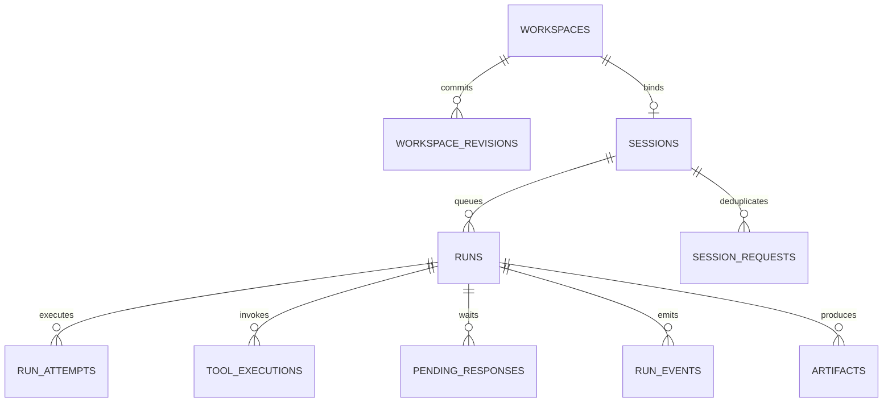

# 数据库实现约束与事务边界

日期：2026-09-14。DDL：[001_runtime.sql](../db/migrations/001_runtime.sql)。目标数据库 PostgreSQL；当前仅完成语法解析，未执行真实迁移或并发测试。迁移是一次性版本迁移，不能反复裸执行 CREATE TYPE；实现者提供 migration runner 和测试数据库。

## 1. 对象关系

scope_id 为用户级执行隔离域，等于 user_ref。Runtime 不创建用户、角色或 Skill 发布表；Platform 负责身份、租户/用户关系、项目绑定和授权，并下发 UserBinding。手工 Skill 的确定包引用放在 runs.config_snapshot，仍由 Runtime 只读消费。Runtime 进程不持有用户工作目录、Skill 列表或会话状态，Worker 只从持久化的 RunContext 恢复本次执行所需引用。

## 2. API 与表字段映射

| API/核心字段 | 数据位置 | 说明 |
| --- | --- | --- |
| Run.id/session_id/run_seq | runs 对应列 | UUID；run_seq 在 Session 内正序 |
| RunCreate.context | runs.execution_context | 规范化 scope/actor/external 及 UserBinding；无真实凭据 |
| UserBinding.scope_id/user_ref | workspaces.scope_id/user_ref | 用户稳定 ID，两个字段必须一致 |
| UserBinding.tenant_ref | workspaces.tenant_ref | Platform 管理的租户稳定引用，不复制业务权限模型 |
| UserBinding.user_path | workspaces.user_path、runs.config_snapshot | Platform 下发的用户根路径和用户隔离边界 |
| UserBinding.storage_root/user_rel_path | workspaces.storage_root/user_rel_path、runs.config_snapshot | 稳定 NAS 根与用户逻辑路径；绝对路径由两者组合解析 |
| UserBinding.project_ref/project_path | workspaces.project_ref/project_path、runs.config_snapshot | Project 稳定引用与执行根；project_path 位于 user_path 下，接受 Run 时冻结 |
| RunCreate.skill_paths | runs.config_snapshot.effective_skill_paths | 缺省为 user_path/config/skills；显式传入时按顺序覆盖默认路径，可为空以禁用默认 Skill |
| date_created/created_by/date_updated/updated_by | 所有自管表对应列；Session/Run读接口同名字段 | 由服务生成，不接受客户端自由写入 |
| Run.snapshot / RunSnapshot | runs.config_snapshot | 不可变对象，字段与核心 DTO/OpenAPI 完全一致 |
| AcceptedRun.reused | 响应时计算 | 不存数据库；判断命中已有请求 |
| status/state_version/task_outcome | runs 对应列 | 使用核心枚举与状态机 |
| wait_reason | runs.wait_reason | 仅等待状态非空，离开等待时清空 |
| Event.event_id/message_id/session_id/seq/type/occurred_at/data | run_events 列经公开投影 | message_id 映射 Run ID；公开 seq 使用 session_seq |
| SSE id / event_cursor | sessions.next_event_seq 与 run_events.session_seq | 格式 session_id:seq；不使用内部 run_id |
| Session.workspace_id | sessions.workspace_id、runs.workspace_id | 同一用户 Project 的 Session 共享 Workspace；不由客户端填任意路径 |
| OperationSpec.operation_id | tool_executions.id | 与实际 PID/external_operation_ref 分离 |
| OperationSpec argv/资源/profile | tool_executions.input_ref 指向的不可变输入对象及 profile 列 | 参数摘要参与幂等；不可把不同命令绑定同一操作 ID |
| PendingResponse.prompt | pending_responses.payload.prompt | payload 结构由 kind 的处理器校验 |
| PendingResponse.resolved | resolved_at 非空 | 不额外保存第二个布尔事实 |

查询层可以投影字段，但不能建立另一套可独立写的运行状态。config_snapshot、request_fingerprint、input、run_seq 在接受后不可变；禁止通用 ORM patch API 修改这些字段。SDK 序列化 JSON 时必须保存所有必需快照字段，不能用字符串 `repr(dataclass)`。

## 3. 统一锁顺序

需要多个运行对象的事务按 Workspace → Session → Run → Attempt → Tool/Pending 的顺序加锁，短事务内完成，不持锁调用模型、执行命令或下载 Skill。创建 Session 涉及用户 Project Workspace 与 session_requests 时使用单独的创建事务；同一用户同一 Project 的多个 Session 复用同一 Workspace。

选择任务时可先查询候选 Session，再用 SKIP LOCKED 领取 Session，随后验证其队列和 active_run；不要先锁 Run 再反向等 Session 导致与接受/取消路径死锁。实现者可以优化 SQL，但必须保持统一锁顺序与正确性。

## 4. 五条原子边界

### 接受 Run

校验 Session scope 和 UserBinding 与持久化 Project Workspace 一致，锁 Session，重新查 idempotency_key。存在则比较 fingerprint：相同读取原 Run 返回；不同报冲突。不存在则从 next_run_seq 分配顺序、插入含 workspace_id/config_snapshot 的 QUEUED Run、写第一条接受事件、更新 Session 序号，一次提交。

只有事务提交之后响应 202。外部快照字节先保存，事务失败产生的无引用内容可延后清理。已保存的幂等记录不能因为任务完成立刻删除，否则网络重试可能重复任务。

### 领取执行

先锁 Workspace 并获取 writer lease，再锁 Session 检查 active_run：无主任务时只允许队首；已有主任务则只能恢复同一 Run。增加 Session execution_epoch 与 Workspace epoch，固定 workspace_base_revision、mount_spec_ref、working_directory_ref，写 Attempt 与 lease、更新活动指针，转 RUNNING 并写 run.started，一次提交。

本版移除条件索引。唯一主任务由 sessions.active_run_id 保证，用户 Project 级唯一 writer 由 workspaces.active_attempt_id + workspace_epoch + lease + 行锁保证。旧 epoch 不能写 Workspace revision；不能仅查询 status 或 ended_at 就无锁认定执行权。

### 状态与事件

加载 RunState，调用核心 transition；UPDATE 使用预期 state_version，活跃 Worker 写还需当前 Attempt/epoch/有效 lease。0 行更新是 STATE_CONFLICT，不当成功。changed=False 的取消不写第二条取消事件。

事件序号通过锁住 Run 后递增 next_event_seq 分配。状态更新与关键事件同事务；DELTA 可按批次合并，但发布的事件必须可回放。不能先通过 SSE 发布一个尚未持久、却承诺一定能回放的关键事实。

### 工具意图与结果

图的工具计划先持久化，再以稳定 logical_call_key 建立 PREPARED 操作。重复槽同摘要查回，不同摘要报冲突。派发之后外部执行与数据库不在同一事务，返回丢失时查外部句柄/本机操作记录；不能把 timeout 自动等价于没执行。

结果文件/日志先持久，再写入 workspace_revisions 并 CAS 更新 workspaces.current_revision，随后提交 input_revision_id/result_revision_id、result_ref 和状态/事件。process_ref 仅供核验，不能只凭 PID 自动认领或杀进程。

### 完成或消费回应

完成：验证输出与成果引用、更新 Run 终态和结果、结束 Attempt、清理 Run.active_attempt_id、Session.active_run_id 与 Workspace lease，写 run.finished，在事务中完成。

回应：先验证归属，再查 response_key 的既有消费记录；同摘要重试返回当前 Run，不因原 expected_state_version 已过期报错。新回应才验证 pending 未解决及预期版本，原子保存回应、恢复 QUEUED 和 run.resumed。审批类型仍是预留，不要求一期实现审批工作流。

## 5. 检查点与工作区的独立事实

框架 Checkpointer 自己管理其序列化表。必须验证 put 与 put_writes 的租约检查和写入共用事务连接；外层先查租约再调用独立 saver 不能保证防旧写入。

Workspace 的 manifest/内容先可靠写入，再插入 workspace_revisions，数据库 current_revision 用预期父修订、active_attempt_id 和 workspace_epoch 共同 CAS 更新。代码/文件物理写入与图检查点不原子，工具账本保存输入/输出修订，恢复先核验再继续。部分失败修改可保留，但新 Run 应知道前序失败，不自动恢复旧文件或清除用户修改。

如果一个失败/取消的图仍有 pending tool calls，下一轮不能直接 invoke 旧 checkpoint 触发它们。实现者需验证非执行式收尾；若框架无法安全规范化，则为 Session 创建新 thread_id，携带已确认的会话事实和 Workspace，保留旧 Attempt/checkpoint 供审计。该映射调整不改变产品 session_id，且不得把未确认工具结果编造为成功。

## 6. 审计字段与索引规范

所有10张自管表使用 date_created、created_by、date_updated、updated_by，包括只追加的事件/修订表和幂等请求表；每张表/字段有 COMMENT ON。date_created/date_updated 类型为 timestamptz，不是仅保存日期的 date。

- 新增：两组时间和主体相同；可信 actor_ref 表示用户动作，后台用 system:runtime/api、system:runtime/worker 或 system:runtime/reconciler。created_by/updated_by 不设默认值，适配器必须显式传入，禁止空白或伪造用户身份。
- 修改：保留新增字段，更新 date_updated/updated_by。核心 audit.on_update 提供纯规则，时间由适配器在获得锁后读取数据库时钟，例如 SELECT clock_timestamp()，避免长事务开始时间早于上一笔提交。
- 幂等复用/无修改：四个字段不变。事件/不可变修订正常只插入，date_updated保持初始值；运维修复需独立审计，不任意改写历史。
- 时间默认值只处理 INSERT，不会自动刷新 UPDATE；Repository 每条有实际修改的 SQL 必须写修改审计字段。客户端不可在请求中指定这四个字段；Session/Run读接口按同名输出。
- occurred_at、lease_until、heartbeat_at、due_at、deadline_at、ended_at、resolved_at 等是业务时间，保留各自语义，不能以 date_updated 代替。

索引只允许主键、简单列普通 B-tree、简单列唯一索引；可复合列。移除了所有条件索引，不使用表达式、INCLUDE、GIN/GiST等特殊形式。外键/CHECK/enum仍保留，它们是完整性约束而不是新索引类别。

索引目的：idx_runs_status_due_created 扫描全局队列，idx_runs_scope_status_due_created 扫描 Project 队列，idx_runs_session_status_seq 查 Session 队列，idx_attempts_ended_lease 扫描需核验尝试，idx_attempts_run_ended 查 Run 尝试。UNIQUE 约束负责幂等键、序号、Project/Workspace 唯一绑定及作用域引用；活动执行权由指针事务保证。

## 7. 迁移与验证门槛

最低真实数据库验证：创建/回滚迁移、同键并发接受、同用户同 Project 多 Session 的 Workspace 顺序、等待主任务阻塞、取消/完成竞态、旧 workspace epoch 写拒绝、跨 user scope 外键拒绝、事件 seq 唯一、snapshot 查询水位一致。使用真实 PostgreSQL，不用内存 FakeRepository 代替这些验收。

DDL 的字符串/JSON 之外还需适配器做来源、JSON schema、文件归属和语义校验。代码里的纯状态机不承担数据库事务；数据库约束也不证明进程/外部副作用已被隔离。
