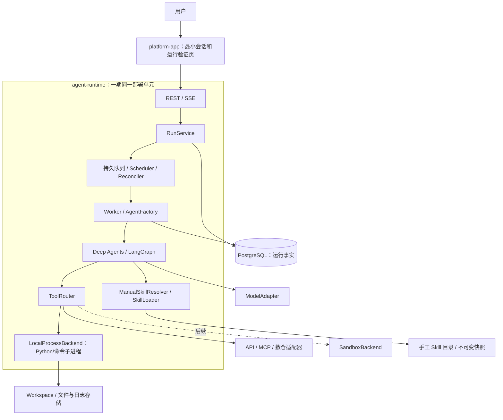

# Agent Runtime 详细设计与实现约束

版本：0.5；日期：2026-09-12；状态：用户级数据领域修订已进入本地 Runtime 实现。

本轮交付核心契约、状态逻辑、接受任务参考代码、PostgreSQL DDL、OpenAPI 和实现说明。没有交付运行中的 Agent 服务或 Platform。核心单元测试通过不等于 Deep Agents、数据库、Python 执行或端到端流程已集成通过。

## 1. 已确认范围与交付顺序

本次重点是验证 Agent 运行能力。优先实现 agent-runtime，platform-app 只做最小主流程验证入口。两个应用，Runtime 内部 API、调度、Worker、恢复扫描一期合并部署；后续按负载拆分。

一期 Python 在 Agent 所在机器通过子进程执行。LocalProcessBackend 通过统一 ExecutionBackend 契约接入，后续增加 SandboxBackend。当前是可信内部默认授权验证阶段，本机子进程不是沙箱；不宣称已具备恶意代码隔离或生产级多租户安全。

Skill 通过文件手工编辑。Skill 编辑发布 UI、权限后台、审批流程、文件/报告展示均后置。默认授权仍经过可替换的 AuthorizationPort；无需为验证主流程先建设 RBAC、企业身份服务或发布系统。

主流程：创建会话 → 提交任务 → Deep Agents 规划/调用工具 → 读取或修改文件/执行 Python → 读取结果并继续 → 输出结果 → 在原会话继续下一轮。Coding、数据分析和图表/报告的生成能力属于 Agent 能力；报告专用展示界面不是当前交付要求。

完整 Agent 循环、各分支及框架职责见 [全流程设计](agent-workflow.md)，每个分支的测试定义见 [用例集](testing/agent-workflow-cases.md)。代码结构/依赖/事务/审计标准见 [代码规范](coding-standards.md)。

## 2. 规范文件与一致性规则

| 内容 | 权威文件 | 实现要求 |
| --- | --- | --- |
| 领域状态、错误码、事件名、核心 DTO | [contracts.py](../src/code_forge/contracts.py) | 不在子模块另建一套命名 |
| 端到端分支/DA-LG-RT职责 | [agent-workflow.md](agent-workflow.md) | B01—B48逐项对应测试用例 |
| 代码目录/设计规范 | [coding-standards.md](coding-standards.md) | 核心依赖方向、错误、异步、审计和索引一致 |
| 状态转换 | [state_machine.py](../src/code_forge/state_machine.py) | 所有状态修改遵循转换表，存储层负责 CAS |
| 任务接受顺序 | [service.py](../src/code_forge/service.py) | 先查幂等记录，再解析 Skill，再原子接受 |
| 可替换依赖 | [ports.py](../src/code_forge/ports.py) | 存储、授权、快照、执行后端实现接口，不反向耦合 Platform |
| 表结构与数据库约束 | [001_runtime.sql](../db/migrations/001_runtime.sql) | PostgreSQL 架构基线，框架 checkpoint 表单独管理 |
| Platform 接口、事件 payload | [openapi.json](api/openapi.json) | 字段、状态、错误、分页不自行改名 |
| 接口语义与示例 | [Platform 接入约定](api/platform-runtime.md) | 区分提交、排队、等待、取消、恢复与结果 |
| 实现分工与验收 | [实现智能体交接](implementation-guide.md) | 按依赖顺序工作，遇到契约问题反馈架构变更 |

OpenAPI 和状态 JSON 由 [export_contracts.py](../scripts/export_contracts.py) 生成；修改生成源后重新导出并跑一致性测试，不手改生成文件。文本与契约冲突时不得猜测，以本表权威源定位并提交变更；未经架构确认不把临时实现差异固化为接口。

## 3. 功能架构与两个应用

Platform 通过 HTTP/SSE 访问 Runtime，不直接读数据库、文件目录或框架 checkpoint。Platform 管理 Tenant/User/Project 并下发已授权的 `UserBinding`；Runtime 以 user_ref 作为 scope_id，以 Platform 下发且校验过的 user_path 作为用户隔离基准，以 user_path 下的 project_path 作为 Agent 固定执行根。所有绑定和本次 Run 的有效 Skill 路径在接受时冻结。

Runtime 角色合并部署不等于只用内存队列。持久 Run 是队列事实来源，每个执行者有 worker_id；多副本时仍需原子领取和租约。首个本地主流程里程碑可单副本验证，多副本恢复必须另行通过相应验收才标记完成。

## 4. 核心领域与存储

Session 对应一个持久框架 thread_id；每个 Project 对应一个 Workspace，多个 Session 可以共享该 Workspace。Run 表示一次被接受的输入；Attempt 表示一次实际执行/接管。配置快照固定在接受时，工作区起点在取得 Workspace writer lease 时固定。普通后续输入创建新 Run，澄清回应恢复原 Run。

表的职责：

- workspaces / workspace_revisions：Platform 路径绑定、Workspace writer lease、已提交修订与 manifest，保留父修订链。
- sessions / session_requests：会话、Workspace/Thread 映射，以及创建会话的幂等请求。
- runs：输入、请求摘要、配置快照、顺序、状态版本、输出和下一事件序号。
- run_attempts：当前执行者、Session 递增 epoch、租约、工作区起点与 checkpoint 引用。
- tool_executions：稳定逻辑调用槽、参数摘要、实际执行位置、结果与未知状态。
- pending_responses：信息澄清、结果核验；approval 类型仅预留，不开发审批产品。
- run_events：可持久回放的事件；artifacts：生成结果引用与来源，专用展示后置。

所有业务资源按 scope_id=user_ref 关联，复合外键防止跨用户误绑。`user_path` 是用户隔离基准，`project_path` 必须位于其下并作为 Agent 可写根。Skill 不隶属于 Workspace：缺省使用 `user_path/config/skills`，Platform 可在 Run 请求中传多个显式路径覆盖该缺省值。不能仅凭随机 ID 作为将来的访问授权；当前 default allow 是可信验证模式，路径逻辑隔离不构成文件系统安全边界。

字段映射、统一锁顺序和各事务写入边界见 [数据库实现说明](database.md)。

SQL 对唯一请求键、Session 顺序及结果状态做约束；唯一主任务/有效Attempt由活动指针、行锁与epoch事务保证。Session.active_run_id 的逻辑归属仍须在事务中管理，等待时不能让后序 Run 越过。DDL 不自动提供整个调度算法。

框架 checkpoint 表由锁定版本 saver migration 管理，不能用 runs.output 代替。产品消息以 Run 的 input/output 与结构化事件为基础生成；不在 Platform 维护另一套可独立修改的运行事实。

## 5. 任务接受、调度与完成

### 5.1 接受事务

参考 RunService 的顺序：校验请求 → 授权接口 → 确认 Session → 查同键已有请求 → 解析并保存不可变快照 → Repository.accept_once。

accept_once 必须在一个事务中再次检查唯一请求、验证 UserBinding 与 Session Workspace 一致、锁定 Session、分配 run_seq、写输入/冻结快照/QUEUED Run、分配 seq 并写 run.accepted。提交成功后才响应 202。并发同键同摘要返回同一 Run；同键不同用户路径、显式 Skill 路径或其他请求内容返回 IDEMPOTENCY_CONFLICT。

快照解析可能有文件 I/O，不长时间持有 Session 锁。已解析未被引用的包由延后清理处理；不能以跨文件/数据库事务为由先响应接受再保存内容。

### 5.2 领取与执行

调度器读取已到期 QUEUED 候选，按 Workspace -> Session -> Run -> Attempt 的顺序处理，验证 Session 队列和 Workspace writer lease。领取时增加 Workspace execution_epoch，固定 workspace_base_revision、mount_spec_ref 与 working_directory_ref，转 RUNNING 并提交 run.started。

同 Session 写操作串行；不同 Session 可在配置并发额度内运行。长模型 I/O 采用非阻塞调用或受管理执行资源，不能卡住 API/心跳。Python 在子进程运行，不在 Worker Python 进程内 eval/exec。

正常结束前提交完整回复、任务结果、Workspace revision 和文件引用。SUCCEEDED 是执行协议正常结束，task_outcome 分为 completed/partial/blocked；测试证据另行报告。CANCELLING 的任务不能竞争写成 SUCCEEDED。终态后释放 Session 归属、Workspace lease 和 Attempt，下一 Run 才可开始。

## 6. 状态、CAS 和恢复边界

[状态转换 JSON](api/run-state-machine.json)由核心代码导出。禁止终态原地复活。state_version 每次状态变更递增，数据库更新同时校验预期版本；纯 Python 校验不能代替数据库 CAS。

| 场景 | 处理 |
| --- | --- |
| 用户重复点击取消 | request_cancel 幂等；已终态返回原状态，不新增重复事件 |
| 正在执行的取消 | 进入 CANCELLING，停止新操作，清理/核验已有进程后 CANCELLED |
| 澄清信息 | WAITING_USER，存 pending_response；回复用 pending_id，不新建主 Run |
| 长工具等待 | WAITING_EXTERNAL，保存操作句柄和下一检查时间；回调不直接并发执行图 |
| Worker 失联 | RECOVERING；检查操作、文件与 checkpoint 后决定排队恢复或等待核验 |
| 本机命令结果未知 | 工具 UNKNOWN；不得盲重跑，必要时 WAITING_USER / execution_reconciliation |
| 用户要求重新做失败任务 | 创建新 Run 和新幂等键；原任务保持终态 |

恢复时关闭旧 Attempt，增加 epoch，校验状态和 checkpoint 写入权。原 Worker 可能只是网络分区；新的主执行者产生后，旧 epoch 写入必须被拒绝。Checkpointer 的 put/put_writes 与租约检查须在同一数据库事务连接中完成，不能先查锁再另起连接写。

框架节点中断可能重执行，副作用必须放在持久操作意图之后。核心代码只定义状态规则；实现者须用真实框架和数据库做故障验证。首期未验证的接管路径应明确失败/等待，不以从头重跑冒充自动恢复。

## 7. 手工 Skill 与版本冻结

一期 ManualSkillResolver 读取指定 Skill 目录，不依赖 Platform 发布功能。目录包含 SKILL.md 与可选 scripts/references/assets；frontmatter 至少 name/description/version。显式提交 skills 列表，空列表表示不激活 Skill，不把所有目录自动塞入每个 Run。

每个版本绑定整个包的内容摘要。接受时读取包字节、验证格式/路径/大小、计算确定 digest、保存到运行管理的不可变快照目录。Snapshot 中保存 name/version/digest/bundle_ref，运行时只读快照，不再读可变源目录。手工修改源文件只影响后来接受的新 Run；已接受请求的重试不重新解析。

同名同版本内容改变仍能由 digest 区分，但应提示维护者递增版本，实际恢复以 digest 为准。未来发布注册中心应拒绝覆盖已发布版本。快照不可变由存储适配器保证，不能只靠在提示词里声明只读。

元数据、正文、支持文件分层读取；只有选定候选能被加载。脚本在 LocalProcessBackend 执行，后续更换 SandboxBackend 不改变 Skill 内容与操作结果契约。ManualSkillResolver 可被 PlatformSkillResolver 替换，Runtime 不需要新增发布数据库。

## 8. LocalProcessBackend 的实现要求

[ExecutionBackend](../src/code_forge/ports.py)定义 capabilities/submit/get_status/cancel/release。一期能力包括 python、command；以后沙箱实现同一接口。OperationSpec 传 UserBinding、workspace_epoch、MountSpec、固定 working_directory、命令参数、超时/输出限制和环境 profile，不能把真实凭据塞进 checkpoint 或公开事件。

必须落实：

1. Python 使用明确的解释器和 argv 启动子进程；普通 shell 为显式工具，不自动把 Python 文本插进 shell 字符串。
2. Platform 已下发绑定时，Agent 固定使用 `project_path` 作为工作根，并校验 working_directory 仍在该 project_path 下；legacy 模式继续使用 Attempt 目录。设置超时、并发、输出上限与最小环境，避免把模型 API Key 等运行服务环境变量整包继承给子进程。
3. stdout/stderr 分流、有界缓存、完整日志按限额保存。输出很大时继续排空或终止，不因管道堵塞卡住 API。
4. 管理进程组和子孙进程，取消/超时时终止整个本次操作进程组并核验退出，不能只杀父 PID。
5. 记录主机/启动实例、PID 与创建时间等核验信息，PID 不单独充当永久操作 ID。Runtime 重启可能留有孤儿进程，不在未核验前自动重跑或随意杀一个复用 PID。
6. 先持久 PREPARED 意图，再派发。相同 operation_id/参数再次提交返回原句柄；不同参数冲突。执行进程成功不代表结果已经持久，文件/结果提交后才能确认完成。
7. 后台服务不能在文件修订发布后继续写工作目录；一期不承诺常驻服务或 PTY，相关 writer 停止/核验后再提交。

本机子进程共享宿主权限；上述是运行可靠性和误操作控制，不是沙箱安全边界。默认授权试点仅面向可信调用，正式开放多租户前应接入真实权限与沙箱并验证。

## 9. Harness 与工具主流程

实现 AgentFactory 使用 Deep Agents/LangGraph，复用工具循环、计划、文件/Skill 抽象与上下文机制。自研代码负责运行契约、存储、工具执行和事件适配，不再额外写一套与框架竞争的 LLM 循环。

一期工具集至少：文件读取/搜索/写入或 patch、execute_python、execute_command、必要的 Git/Diff 能力。数仓/API/MCP 以适配器扩展；先用固定测试工具验证再做真实连接，假工具通过不算真实集成。

每次调用先持久化逻辑调用槽与参数摘要，再执行。逻辑槽绑定 Run 与持久图任务位置；LLM 重新生成的 call_id 不能作为唯一恢复依据。read_file 等内置工具也需经过一致事件/路径适配，不能留下宿主访问的另一条隐蔽路径。

项目 AGENTS.md、当前用户目标与 Skill 以有来源的上下文加载。压缩保留目标、约束、证据、待完成项和活动 Skill 版本。跨 Run 升级 Skill 后避免旧正文/摘要继续充当活动指令；恢复沿原快照，不能静默改版本。

## 10. 最小 Platform

当前只实现：Runtime 健康/模型配置状态、受信 UserBinding 输入、创建与选择会话、输入任务、选择手工 Skill、展示流式消息和工具进展、取消、刷新后重连、继续会话、必要的信息澄清输入。

不实现 Skill 编辑发布、权限/角色后台、审批工作流、报告预览器和文件管理器。Runtime 可先返回文件名/产物引用，Platform 原样展示文本即可。

Platform 不内置 Agent，也不调用 Python。只消费 [OpenAPI](api/openapi.json)和 [SSE 规则](api/platform-runtime.md)。用户重复发送同一网络请求复用 Idempotency-Key；用户明确提交新一轮生成新键。运行时已有待决澄清，输入通过 responses API，而非创建新 Run。

## 11. 接口演进与实现移交

一期平台管理缺省值：legacy scope=default，受信调用方可下发 UserBinding；权限=DefaultAllowAuthorization，Skill 缺省来自 User 的 `config/skills`，Platform 可传多个显式 Skill 路径覆盖，执行=LocalProcessBackend。每项都有明确接口替换位置，不为了未来扩展先实现对应产品。

OpenAPI v1 的字段名/状态/错误码/事件 payload 为跨智能体合作契约。新增可选字段应保持旧客户端行为；删除/改名/改类型或改变幂等范围属于不兼容变更。新增状态或事件必须同步核心枚举、生成文件、DDL/迁移、示例与测试，并经架构确认。

实现顺序、代码归属、测试证据和架构变更处理详见 [implementation-guide.md](implementation-guide.md)。生产 HA、真实模型、真实数仓和沙箱分别验收；本轮架构核心测试只覆盖接受顺序和状态不变量。
