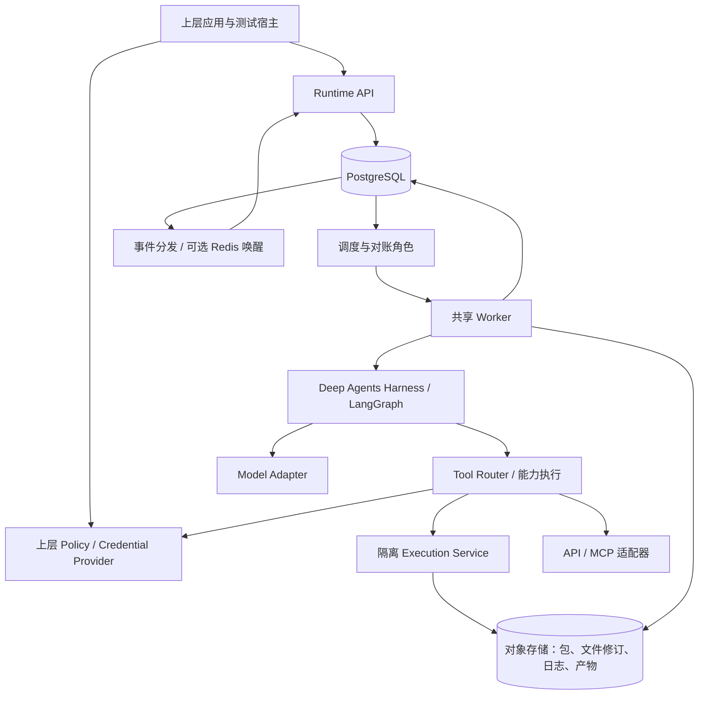
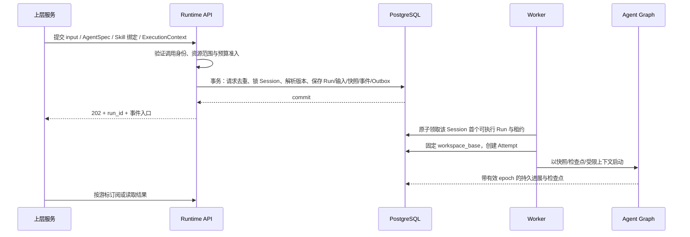
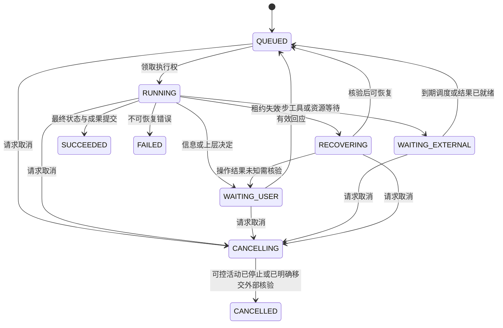

# Code Forge 通用 Agent 底座详细设计

版本：0.1，日期：2026-09-09，状态：历史存档。当前部署/沙箱要求已由 [0.2 两应用设计](../detailed-design.md) 覆盖；本文件不作为一期实施要求。

依据：[已确认需求](../../requirements.md)、[参考能力研究](../agent-capabilities.md)。用户已确认的是产品范围与分层方向；本文提出具体实现方案，尚未做兼容实验、编码、压测或部署。待评审及验证门槛通过后冻结开发基线。

## 1. 设计摘要与约束

首版交付一个可服务化部署的通用 Agent 底座，通过 REST/SSE 给上层产品使用，同时完成 Coding、数据分析与报告任务。核心采用 Deep Agents/LangGraph 库，自研持久 Run Runtime；不使用付费 Agent Server、托管 Agent 产品或竞品 CLI 作为运行依赖。

明确采用的设计方向：

- 业务身份、组织、项目治理、授权策略与审批工作流在上层，底座只有受信服务接入与能力约束执行。
- PostgreSQL 是 Run、调度、操作记录、检查点引用与事件的事实来源；Redis 可选做通知/缓存，丢通知可恢复。
- API、Worker、后台对账角色使用同一代码库，独立部署；代码执行服务在独立信任与资源边界内。
- Run 接受时固定 Agent/Skill/工具/模型配置；工作区起点在获得执行权时固定，确保排队任务看到前序成果。
- 同 Session 主 Run 串行，同 Workspace 单写；不同 Run Attempt 使用独立暂存目录，不挂共享可写目录。
- 文件以不可变修订和对象存储持久化，运行环境按需重建；首版没有长期 PTY 或内存内核承诺。
- 默认正常链路是自主工作；权限等待来自上层策略，信息澄清来自任务语义，两者记录类型不同。

以下为首版建议默认：Python 服务、FastAPI/Pydantic 接口、psycopg 异步数据库访问、PostgreSQL、S3 兼容对象存储、Kubernetes 与一个隔离执行后端。具体版本和镜像摘要在 M0 兼容验证后冻结，业务库/模型供应商可替换。

## 2. 系统边界与部署



底座进程不依赖企业用户服务的数据模型，不直连 User/Project/Membership 表。每个集成通过 ports 契约进入底座。数仓适配器、Git 托管适配器等依赖核心契约，核心不能反向 import 这些业务实现。

| 部署角色 | 责任 | 持久性与扩缩容 |
| --- | --- | --- |
| runtime-api | 受信接入、参数校验、接受任务、查询/控制、SSE、管理接口 | 无会话本地状态，多副本 |
| runtime-worker | 构建 Agent、执行图、适配工具、提交检查点与结果 | 活跃任务有临时内存，持久状态在外部；按就绪任务与调用容量扩容 |
| runtime-reconciler | 扫描可运行/失联/等待/待完成记录、修复投递与终态 | 多副本按 DB 原子领取，不需要单机 leader 保证正确性 |
| execution-service | 操作幂等、隔离环境创建/回收、命令执行、修订提交 | 可独立扩容，不能共享 API/Worker 宿主权限 |
| external adapters | 上层 Policy/Credential、数仓/Git/MCP/模型等连接 | 通过版本化接口集成；部署可外置，首版适配模块不必全部微服务化 |

初期测试宿主只提供提交任务、观察事件、展示文件/Diff 和回传决定的最小联调功能，不建设登录、组织、项目管理或审批后台。生产用户端访问由上层服务代理，不直接信任浏览器提交的执行上下文。

## 3. 与上层解耦的契约

### 3.1 ExecutionContext 与信任来源

接入服务采用 mTLS 或受验证的服务 JWT；`issuer_id` 由认证层导出。请求中的上下文由该受信服务提供并受其签名/通道保护，禁止客户端用可伪造 HTTP 头直接设置授权。

| 字段 | 语义 |
| --- | --- |
| issuer_id | 服务身份导出，不允许请求体覆盖 |
| scope_id | 该 issuer 下的隔离域；唯一性按 `(issuer_id, scope_id)` 计算 |
| actor_ref / external_refs | 可选不透明调用主体/业务追踪引用，仅审计，不参与业务角色判断 |
| grant_ref / grant_revision / expires_at | 授权依据与有效期；不得序列化真实令牌至图状态 |
| resource_bindings | 本次可读/写的 Session、Workspace、Artifact、数据句柄范围 |
| capability_limits | Tool/模型/Skill 集合、文件/网络边界、允许的执行资源档位 |
| budget_ref / limits | 原子计量归属、步数/token/并发/时间/存储上限 |
| provider_profile_refs | 预注册的 Policy/Credential/连接配置引用，不接受任意回调 URL |
| data_policy_ref | 数据出域与脱敏策略引用，由集成适配器解释，Runtime 不解析业务规则 |

上下文分为“可持久引用/约束”和“仅运行时的短期凭据”两部分。凭据不放在 prompt、checkpoint、event、普通日志或 Skill 包。Scope 不能由模型生成，子任务只可收窄上层能力。Grant 引用兑换/校验后的约束为最终依据，调用者正文中的 capability_limits 仅可进一步收窄，不能覆盖签发范围。

### 3.2 四个上层接口

| 接口 | 输入 | 输出与责任 |
| --- | --- | --- |
| AdmissionProvider | 已认证调用服务、操作、资源引用、上下文 | 校验受信 grant/本次请求是否合法；可用离线签名校验实现，不要求直连业务 IAM |
| PolicyProvider | grant_ref、Run、逻辑操作 ID、规范化参数摘要、资源、动作 | `ALLOW`（绑定范围与期限）、`DENY`（原因）、`REQUIRE_DECISION`（外部决定引用） |
| CredentialProvider | 受信授权依据、逻辑操作、预注册连接、受众和最小权限 | 短期凭据或可由 Executor 兑换的一次性引用；负责下游身份委托 |
| Decision ingress | 待决 ID、外部决定 ID、参数摘要、结果、有效期 | 由已认证上层回传；底座验证对应操作、幂等消费并恢复/拒绝 |

接口由核心定义，企业包实现。不在核心定义“项目管理员”“财务角色”或审批人列表。生产默认拒绝没有可信范围的调用；测试实现通过显式 fixture 配置受限能力，不把 allow-all 模式用于生产。

上层访问 Session、历史、事件和 Artifact 时也提交当前能力；写入时检查 grant 不足以保护后续读取。SSE 连接定期检查 grant 到期和撤销水位；到期停止推送，刷新后从游标续传。

`REQUIRE_DECISION` 产生 `PendingDecision`，上层如何审批由其自行决定。底座的 `WAITING_USER` 是执行状态，不意味着内置用户系统。能力续期默认只恢复原任务边界；不允许通过续期扩大冻结的候选工具/Skill。额外能力需新 Run 或明确重新规划流程。

### 3.3 权限变化与依赖故障

底座运行前、每次工具派发、凭据兑换和模型输入构建时检查有效授权/撤销；高风险动作按策略每次在线决策。当前 grant 内可离线执行的操作在有效期内可以继续；需要在线决策但上层不可用时持久挂起，不当成允许，也不丢掉任务。

撤销不保证抹除已进入供应商或已提交远端的操作；停止后续派发、取消可取消的操作，记录不可撤回部分。上层维护业务撤销来源，底座维护通用撤销 revision/有效期与传播延迟指标。默认建议控制面撤销传播目标 5 秒以内，需压测确认；到期检查不依赖这条推送。

## 4. 领域数据与事实来源

下表是逻辑表设计；具体 SQL 与 migration 在开发阶段根据锁定依赖生成。所有资源携带内部 `scope_pk`，以 `(scope_pk, id)` 唯一/外键关联，禁止跨作用域引用。Scope 表仅映射 issuer/外部隔离域，不是 Tenant/User 管理表。

| 表/对象 | 关键字段 | 约束和事实来源 |
| --- | --- | --- |
| runtime_scopes | scope_pk, issuer_id, external_scope_id, limits_ref | 唯一 issuer+scope；隔离映射与调度桶 |
| sessions | id, scope_pk, workspace_id, thread_id, active_run_id, run_seq, epoch | 主串行执行门；Run 编号在 Session 锁内分配 |
| runs | id, session_id, seq, request_key, request_hash, input_ref, snapshot_id, status, state_version, due_at, cancel_requested_at, wait_reason | request_key 在 scope+API 操作域内唯一；状态机事实来源 |
| run_snapshots | id, agent_digest, skill_lock, tool_lock, model_config, runtime_digest, grant_ref, limits | 内容不可变；配置冻结不等于凭据永久有效 |
| run_attempts | id, run_id, epoch, worker_id, lease_until, heartbeat_at, checkpoint_base, workspace_base, status | 同 Run 接管创建新 Attempt；租约以 DB 时间判断 |
| messages / message_parts | id, session_id, run_id, role, part_type, content_ref, status | 最终展示与审计消息；不是第二套可独立修改的图状态 |
| tool_executions | id, run_id, graph_task_ref, call_index, tool_digest, params_hash, intent_ref, external_id, status, result_ref, revision_ref | 唯一 run+稳定图任务调用槽；结果未知有显式状态 |
| pending_decisions | id, operation_id, params_hash, grant_ref, external_ref, expires_at, result, consumed_at | 决定绑定实际操作；重复回调只消费一次 |
| workspace_revisions | id, workspace_id, parent_id, manifest_digest, operation_id | 不可变文件 manifest；workspace.current_revision 以 CAS 推进 |
| artifacts / changesets | id, run_id, revision_id, blob_ref, provenance_ref, base_revision | 完整输出与差异，发布引用晚于 blob 提交 |
| skills / skill_versions / channels | full_name, version, digest, manifest, status; channel_revision | 包不可变，通道 CAS 更新，撤销独立于内容版本 |
| agent_specs / tool_specs | name, version, digest, spec_ref | 发布后不可覆盖；角色/业务归属在上层 |
| run_events / outbox | run_id, seq, event_id, schema_version, payload_ref; delivery_key | 关键事件与状态同事务，通知可重复 |
| usage_reservations / usage_entries | budget_ref, operation_id, reserved, settled, status | 并行子任务/重试统一预留结算，禁止只在 Run 结束后算账 |
| framework checkpoint tables | thread_id, checkpoint_ns, checkpoint_id, metadata, writes | 保留框架格式，访问通过带 scope 和租约校验的适配器 |

索引重点：可调度 Run 的 scope/status/due_at；Session seq；过期 lease；操作未知/等待；事件 run+seq；外部回调 ID。控制字段用类型化列，版本清单和扩展元数据可用 JSON；不把所有状态塞进一个任意 JSON blob。

`RunRuntime` 是 Run 状态唯一写入入口；`FencedCheckpointer` 是图状态写入入口；`ToolRouter` 是操作事实入口；`WorkspaceStore` 是修订发布入口。查询投影读取事实生成，投影失配可重建，不能用事件回放重新触发外部工具。

## 5. 接受任务、调度与唯一写入者

### 5.1 接受时序



技能内容/工具契约在接受前验证可解析，在事务中固定清单与通道 revision；失败返回确定性错误，不先接受后永久悬空。请求体与上下文大小有界，附件在提交前完成上传并作为已授权引用传入。

重复 `Idempotency-Key` 且输入摘要一致返回原 Run；不一致返回 409。摘要包含 scope、Session、任务输入、绑定引用和请求语义，不包含短期令牌值。对同一请求的重试不重新解析发布通道；是否有权读取原 Run 仍用当前 grant 检查。

### 5.2 队列与预算

选择 PostgreSQL 持久队列作为 V1 默认，不另外引入一套 Redis 任务真相。Worker/调度角色使用短事务与 `FOR UPDATE SKIP LOCKED` 领取候选；具体 SQL 应同时检查 Session 当前 active_run 和工作区写入权，不能只锁 Run 行。

按 scope 轮转选择候选桶并执行并发上限；每桶按到期时间和 Session seq 选择。桶领取/调度游标持久化或在事务中协调，多个调度进程不能因为各自局部公平而共同饥饿某个 scope。首版先实现有界公平队列，不做完整通用调度器。

模型、查询和执行池分别有并发额度；排队/审批不占 Worker 活跃执行额度。短模型 I/O 保留轻量异步协程与租约，不能宣称所有等待都可以无代价释放图调用栈；长外部操作通过持久挂起释放。预算预留失败进入有时限等待或拒绝，重试也计入预算。

### 5.3 租约和 fencing

建议初始心跳 5 秒、租约 20 秒、扫描 5 秒、自动恢复最多 3 次，均可配置且需压测。时间使用 DB 时钟。接管在锁定 Session/Run 的事务中增加单调 epoch 并创建新 Attempt；旧 Worker 收不到取消也不得继续合法写入。

所有状态更新和 Checkpointer 的 `put` / `put_writes` 路径必须在同一短事务中锁执行门、检查 `(run, attempt, epoch, lease_until)`，再写入数据。检查后换连接无锁调用官方 saver 会留下竞态，禁止这样包装。读 checkpoint 也必须确认 scope 与 thread 的映射。

框架 saver 若无法复用事务连接：实现符合其协议的 Postgres 适配器，保留框架序列化与表兼容，不修改核心图算法。该适配能否覆盖 pending writes、子图 namespace 和恢复，是 M0 开发前验证门槛，不能用外层分布式锁替代。

执行服务不接受 Worker 直接携带一个 epoch 就修改正式目录。它按已持久的逻辑操作 ID 领取命令意图，并检查当前操作/Run 是否仍允许执行；重复命令返回同一执行句柄。旧 Attempt 即使继续运行也只能改自己的隔离暂存视图，正式修订通过有效操作和 CAS 提交。

## 6. 状态机、取消与恢复



图省略部分终止边：任何非终态在对应时限耗尽可进入 `TIMED_OUT`；恢复耗尽或无兼容运行版本可进入 `FAILED`。`SUCCEEDED/FAILED/CANCELLED/TIMED_OUT` 为终态，不原地改回 RUNNING。用户重新执行创建新 Run 并记录 retry_of；系统接管复用原 Run、创建新 Attempt。

等待期间 Session 的 active_run 保留逻辑归属，后续普通消息继续排队，不能越过待决任务。等待释放租约与计算槽，但 Run 并未结束。响应使用待决 ID 和幂等键，不被解释为新任务输入。拒绝某个工具决定作为受控工具结果让 Agent 尝试允许的替代路径；用户取消则结束任务。

取消事务设置 cancel_requested，停止新派发并传播给模型/工具/子任务/执行环境。已提交且无法取消的远端操作保留 `external_pending`/`UNKNOWN`，由对账角色继续核验；响应明确“任务已停止发起新工作，远端操作仍待核验”，不能报告所有操作已终止。单操作结果后来到达仅更新操作事实，不复活已取消 Run。

恢复顺序：确认执行权 → 读取原版本快照 → 查最后检查点/已持久调用意图 → 核验工具与 Workspace 修订 → 补投缺失结果 → 继续图 → 对账消息与终态。不能直接从头重放用户输入。前序 Run 结束后，队列下一项从当前已提交 Workspace 修订开始，不自动撤销前序失败任务已提交的文件；失败结果须展示保留的部分修改。

LangGraph 中断恢复会重新执行相关节点，放在中断之前的代码必须可重复；外部副作用走操作账本，不在 interrupt 前裸调用。框架中断异常不得被普通错误捕获吞掉。实际用法按锁定版本验证。[LangGraph Interrupts](https://docs.langchain.com/oss/python/langgraph/interrupts)。

## 7. Agent Harness 组装与上下文

### 7.1 复用框架，补足平台语义

`AgentFactory` 根据不可变 AgentSpec、RunSnapshot 和运行上下文构建/选择图。复用 Deep Agents 的推理工具循环、计划、Skill/文件抽象、压缩和子任务接入；通过明确中间件及 backend 接入底座。不能同时启用两套独立消息持久化或在图外再驱动一层互相竞争的 LLM 循环。

AgentSpec 包含 prompt_profile、model_profile、tool_refs、skill_bindings、instruction_policy、subagent_specs、context_budget、step_budget、hook_refs、execution_profile 和 output_contract。它不含业务角色或用户密码。

中间件职责顺序：装配受限上下文与指令 → 预算检查 → 模型请求 → 验证/持久化模型产生的操作意图 → 工具执行边界 → 结果引用化 → 更新计划/验证证据 → 最终结果校验。具体挂载次序以锁定的 Deep Agents 中间件栈验证，不能只靠相同类名假定覆盖成功。[Deep Agents Customization](https://docs.langchain.com/oss/python/deepagents/customization)。

框架内置文件/执行工具必须路由到受控 Backend，禁止留下一条可绕过 ToolRouter 或执行记录的默认路径。只读图结构可以缓存；带 scope、grant、workspace、messages 的实例状态每 Run 隔离。

### 7.2 项目指令与计划

InstructionResolver 只读取授权仓库路径，默认识别根及目标路径祖先的 AGENTS.md；子目录约定只适用于该子树。指令记录路径、hash、读取时修订与适用范围。上层运行约束和当前用户任务优先；仓库指令、Skill 或工具输出不能改变能力边界。

上层可显式启用 CLAUDE.md/其他格式兼容映射，避免同时重复载入互相冲突的规则。Run 起点冻结已有指令；修改指令文件可作为代码成果，但当前 Run 不自动取得新权限，新 Run 再解析更新。进入此前未探索的目录可按当前 Run 的 instruction snapshot 加载其约定。

复杂任务维护结构化计划，简单任务允许直接完成。状态包含 pending/in_progress/completed/blocked 与证据引用。`completed` 不自动代表测试通过；验证证据是独立字段，计划不得控制真实任务状态机。

### 7.3 上下文与输出

ContextManager 管理 system/instruction/active_skill/task/working_summary/recent_messages/tool_refs 分区。大文件和日志以引用加小片段提供，保留工具调用与结果的配对。建议在模型上下文可用额度达到约 70% 时压缩，并预留下一轮工具输出与响应空间，阈值按模型配置校准。

压缩摘要包含目标、用户限制、已完成动作、证据索引、当前文件修订、未完成计划、待决操作和活动 Skill 版本。最新执行授权从运行上下文重新注入，不依赖摘要记忆。先写持久摘要及替换映射，再切换供模型使用的上下文；压缩失败保留旧上下文并减少可选材料，不能无界重试。

Skill 升级时从模型工作上下文移除旧激活指令，将相关历史转为有来源的事实记录；持久审计原文不删。旧摘要若混入旧指令必须重建或停用。禁止破坏供应商要求的消息格式，清理由适配层生成新的有效上下文；含不透明供应商压缩项时无法证明已清理，启用新运行上下文并携带授权范围内的结构化事实，必要时返回新会话要求。

最终输出协议区分 Runtime 结束与任务达成：`task_outcome = completed / partial / blocked`，附 summary、artifacts、changeset、verification、remaining_work。Run `SUCCEEDED` 表示正常完成协议并可靠提交结果，不自动代表业务验收成功；接口/UI 必须同时展示 task_outcome，任务质量指标按 completed 且验收通过计算。若任务无法继续但可给出报告，允许正常返回 blocked；基础设施无法完成协议则 Run FAILED。

## 8. Skill 注册、版本解析与热加载

### 8.1 存储与发布接口

上层 CI/Skill 管理工具使用独立受信管理身份上传包；接受式流程：上传至 staging → 校验 manifest/路径/大小/依赖/内容 hash → 运行发布测试 → 注册 VALIDATED 版本 → 上层授权发布 → 标记 PUBLISHED / CAS 更新通道。运行身份不能发布，运行中的 Skill 文件始终只读。

Bundle 包含标准 SKILL.md、scripts/references/assets 与平台 manifest。示意字段：full_name、version、digest、entrypoint、required_tools、dependency_lock、execution_profile_digest、supported_runtime_range、input/output_contract、required_capabilities、test_refs。没有脚本的纯说明 Skill 不要求执行镜像；脚本存在时依赖/镜像明确。

全限定名避免 Team/User 同名覆盖，scope 限定包隔离域，实际可访问集合仍由 grant 校验；System/Team/Project 的选择与发布审批归上层。依赖解析拒绝循环、冲突、越过候选授权域和未知工具契约。包解压防路径穿越、外部符号链接与压缩炸弹；不允许从包内 URL 获取可变执行依赖。

### 8.2 两阶段加载

1. 接受时：解析上层给定绑定到确定版本/目录快照，保存依赖闭包，只加载授权候选摘要。固定版本绑定不随通道更新。
2. 执行时：Agent 显式选择或自动选择某候选，按 digest 拉取正文；引用资源按需读取。记录 `SKILL_ACTIVATED`，同 Run 去重激活。
3. 运行脚本：将已校验的包材料只读物化到执行环境，工作文件放独立 Workspace。不能假定注册存储里的文件自动出现在 shell 文件系统。
4. 缓存：受限共享只读内容缓存按 digest 存储；获取引用前检查授权。激活状态、候选列表和可变文件视图按 Run 隔离。

发布新版本不重启 Worker。旧 Run/接管继续旧锁文件；新 Run 重新解析上层绑定。通道变更和撤销事务写事件，所有后续加载检查状态。紧急 REVOKED 阻止继续使用并进入待决/终止，已发出的脚本按取消规则处理，不替换新版本继续执行。

Deep Agents 提供动态候选构造和渐进读取，注册/版本/部署文件物化由本项目实现。[Deep Agents Skills](https://docs.langchain.com/oss/python/deepagents/skills)。

## 9. 工具操作账本与外部副作用

### 9.1 通用工具描述

ToolSpec 至少有：名称/版本/digest、JSON 输入输出 schema、capability、side_effect_class、timeout、retry_policy、cancel_support、idempotency_mode、result_limit、executor_kind、connection_profile_ref。执行结果统一为 `status + small_content + output_refs + external_operation_ref + usage + provenance + error`。

Agent 只看授权工具描述；任意参数在调用边界再次校验。PolicyProvider 返回需要决定时先保存 PendingDecision 再中断，错误/拒绝作为结构化结果，不隐去实际限制。

### 9.2 意图先持久化

```text
LLM 输出工具调用
→ 持久化该模型步骤/调用列表
→ 按稳定调用槽注册 ToolExecution（PREPARED）
→ 当前权限、预算预留与参数校验
→ 持久化派发意图（DISPATCHED）
→ Executor/远端按稳定 operation_id 执行
→ 结果及文件修订提交（SUCCEEDED/FAILED/UNKNOWN）
→ 向图提供结果
→ 图检查点提交
```

逻辑 operation_id 由平台分配并持久化，绑定 `Run + graph_task_ref + call_index` 和参数 hash；框架模型调用 ID 只作关联。相同调用槽不同参数视为冲突，不复用旧结果，也不在同槽悄悄发新请求。图恢复必须先复用已持久的模型调用列表，不能重新推理生成一次相似写操作。

使用同步耐久检查点边界或等价平台提交门，确保含调用意图的状态落盘后才派发。框架是否保证该边界须在 M0 故障点测试；若不满足，加入 durable tool-plan 节点/适配层，不带缺口上线。

调用成功但返回前 Worker 崩溃，恢复优先按 operation_id/外部 ID 查回结果。远端支持幂等时原键重试；否则未知操作进入核验。默认认为任意 shell、Git 远端写、业务 API 写都可能有副作用，不以命令名称推定安全重跑。读取重试也遵守预算与数据时点记录。

### 9.3 异步与幂等窗口

SQL/构建等长操作返回可持久句柄，挂起至 webhook 或 next_poll_at 触发；回调按预注册连接身份认证，重复回调幂等更新。回调只记录结果就绪，不直接启动一个并发图执行者。

取消、超时或断线不会把未知写操作自动记成 FAILED。对账查得成功后保存事实，是否继续图取决于 Run 当前状态；终态 Run 不复活。外部幂等保存时间必须覆盖平台支持的恢复期限；期限超出则核验，不能换键重试。

## 10. Coding 执行、文件修订与 Git

### 10.1 ExecutionBackend

核心定义 `prepare_workspace`、`read/search/apply_patch`、`submit_command`、`get_operation`、`cancel_operation`、`commit_revision`、`release_environment`。这些是语义接口，可能由一个远程执行服务实现，无需每个方法一个微服务。

命令输入包含 argv 或显式 shell command、cwd、环境配置引用、工作区修订、资源/时限、允许网络与 operation_id。返回 stdout/stderr 片段及完整日志引用、exit_code、状态、实际环境镜像、输出修订。非交互 stdin 可有界输入；需要密码交互等情况返回不支持/等待上层凭据，不能永久挂死。PTY 与用户实时按键界面后置。

代码工具链镜像按 digest 固定。建议首批验收使用 Linux 上 Python 与 Node.js/TypeScript 仓库，其他语言通过 image profile 扩展；最终矩阵由实际业务仓库确定，不把此建议当成用户已确认。安装依赖仅在隔离环境进行，使用授权 registry/代理、lockfile 和有限缓存，不污染 Worker。

### 10.2 工作区持久策略

V1 默认采用“对象存储不可变文件 manifest + 每 Attempt 独立 POSIX 暂存工作区”，不把对象存储直接作为 POSIX 盘，也不让失联旧容器挂同一可写 PVC。

- manifest 记录相对路径、文件类型/权限、内容 digest、受控符号链接目标和删除；大文件以 blob 保存。读取/解压禁止逃逸 workspace，执行环境不得可见其他用户文件或宿主目录。
- Run 获得写入权时记录 workspace_base；后续每个有修改的工具完成后，执行服务停止该操作的写入进程、生成差异 manifest、上传对象，再 CAS 发布 workspace.current_revision。命令失败也可提交部分文件，结果必须标明失败和保留修改。
- patch 带预期基线 hash，冲突返回结构化错误，不模糊覆盖；路径/二进制/新文件/删除均进入 ChangeSet。
- blob 提交在数据库引用前；上传完成但未引用是孤儿，可延后 GC；数据库已引用的缺失 blob 是完整性错误，阻止报告成功。
- 工具成功确认必须晚于文件修订与结果记录持久化；容器崩溃前尚未提交的中间写入不承诺保留，界面只把已提交内容标为已保存。
- 后台进程不能在修订提交后继续写目录。首版按操作/Run 生命周期管理进程组，提交前停写或拒绝存在不受控 writer 的提交；短期测试服务器与浏览器验证可在同一受控操作中启动、使用并退出。
- Git 对象、索引和 refs 如需跨环境续用，作为工作区保留数据提交；依赖缓存、临时构建目录可排除但排除规则明确。不能把整个 `.git` 默认忽略后仍声称 Git 状态持久。

执行服务持久化 operation_id → 环境/进程/结果/修订关系，Worker 接管可查回已完成操作。旧环境的暂存输出最多作为待核验材料，只有通过当前操作状态和修订 CAS 才能成为正式成果。对象存储写权限在受控提交组件，Agent 进程不持有全域凭据。

### 10.3 Coding 闭环与证据

工具覆盖仓库 import/init/checkout、文件列表/搜索/读取、精确 patch、多文件编辑、命令构建/测试、日志读取、Git status/diff/log、可选授权的 commit/push/PR 连接器。Commit 作者由上层传入配置，不能把服务账号冒充用户。仓库 clone/依赖安装期间的网络与凭据遵守最小作用域。

任务起点保存 repo URL 引用、commit SHA、分支及 dirty/untracked 文件修订。不得自动清理、reset 或覆盖用户已有修改。ChangeSet 相对 workspace_base 生成，并可附相对 Git base 的差异；两者意义不同。远端 push/PR 按工具副作用契约处理，仓库访问并不自动授权部署。

测试/构建证据必须记录执行命令、镜像、输入修订、依赖 lock 摘要、退出状态与日志引用。测试后代码再改动则证据不再对应当前修订，需要重测受影响部分或明确未验证。没有工具链/网络/凭据时记录环境阻塞，不能声称通过。

文件恢复通过新建修订恢复指定基线，原历史保留；首版先提供机器接口与 Diff，用户 rewind UI 后置。恢复文件不能撤回数仓/API/Git 远端操作，必须另行核验。成本方面先测真实仓库的修订耗时与大小；若对象快照不能满足目标，再引入可靠文件服务，并重新证明旧写入者隔离。

## 11. 数仓与报告适配

数仓适配器实现元数据搜索/读取、查询提交/状态/取消、结果分页/句柄；分析 Skill 提供口径和流程，Python/报告工具使用同一个 ExecutionBackend。核心 Run 不出现 Hive/Impala 专用状态或字段。

上层负责数据授权与身份委托，受信数仓网关/引擎最终执行行列权限。适配器校验 SQL/只读边界、查询资源、超时与结果限额。SQL parser 必须适配实际方言，错误不能降级为字符串前缀判断。

结果引用包含 connection_ref、query_id、schema、统计摘要、分区/快照/执行时间、访问策略和有效期；大表留在受控存储。结果过期时重新授权获取，不能永久绕过数仓权限。上层不允许明细出域时，模型只读取批准的聚合/脱敏内容。

分析成果保留 SQL/参数、指标定义引用、数据时点、Skill/脚本版本、执行环境与图表/报告的父子关系。真实集成数据暂未提供时可以用固定 fixture 做契约测试，但上线验收必须包含真实数仓连接及对应权限，不把 mock 通过当作完成集成。

## 12. REST、事件与控制接口

### 12.1 API 草案

所有资源接口使用当前受信服务上下文；无登录、用户、角色或企业项目 API。下列为 V1 契约草案，不是已经运行的端点。

| 方法与路径 | 行为 |
| --- | --- |
| POST /v1/sessions | 在 scope 内创建 Session/Workspace 或绑定已授权 Workspace；幂等 |
| GET /v1/sessions/{id} | 返回状态、Workspace 当前修订及运行摘要 |
| GET /v1/sessions/{id}/messages | 游标分页，返回结构化消息/证据引用 |
| POST /v1/sessions/{id}/runs | 提交任务、绑定和 ExecutionContext，202 返回 Run；Idempotency-Key 必需 |
| GET /v1/runs/{id} | 状态、task_outcome、等待原因、进度、成本和已发布结果 |
| GET /v1/runs/{id}/events | SSE；Last-Event-ID；跨 API Pod 可续传 |
| GET /v1/runs/{id}/snapshot | 当前可见消息、任务事实与同一数据库一致性快照的事件水位，用于游标过期恢复 |
| POST /v1/runs/{id}/cancel | 幂等持久化取消请求，返回当前取消/外部待核验状态 |
| POST /v1/runs/{id}/responses | 提交信息澄清或上层决定；带 pending_id/response_key/匹配摘要 |
| POST /v1/runs/{id}/grant-refresh | 上层续期/收窄能力，不能扩充冻结候选或恢复已撤销操作 |
| GET /v1/workspaces/{id}/revisions | 文件修订分页与 manifest 元数据 |
| GET /v1/runs/{id}/changeset | 相对任务起点的 Diff、文件清单及验证证据 |
| POST /v1/workspaces/{id}/restore | 创建恢复修订；只在无活跃 writer 时执行，带预期 current_revision |
| POST /v1/uploads + POST /v1/uploads/{id}/complete | 申请受限上传，完成后校验大小/hash，返回可作为输入的文件引用 |
| GET /v1/artifacts/{id}/content | 当前授权后代理下载或短期链接；链接不跨 grant 有效期 |
| 管理接口 /v1/agent-specs、/v1/tool-specs、/v1/skills | 版本注册/校验/发布技术操作，仅允许受信管理服务调用 |
| PATCH /v1/skill-channels/{id} | 按预期 channel_revision CAS 改指向，不修改历史版本 |
| POST /v1/skill-versions/{id}/revoke | 紧急撤销，影响后续运行/激活；发布业务审批不在此实现 |

错误统一 `code/message/retryable/resource_ref/request_id/details_ref`。区分 401 无受信服务身份、403 范围拒绝、404 当前 scope 内不存在、409 幂等/修订/状态冲突、422 schema/依赖不兼容、429 准入限额、503 依赖不可用。不得用不同错误泄露其他 scope 对象是否存在。

完整请求示意（真实授权材料经服务通道/引用校验，示例不是可执行授权）：

```json
{
  "input": {"type": "text", "text": "修复分页接口，并运行相关测试"},
  "agent_ref": "coding@1",
  "skill_bindings": [{"name": "engineering/test", "channel": "stable"}],
  "execution_context": {
    "scope_id": "scope-a",
    "actor_ref": "opaque-actor",
    "grant_ref": "grant-123",
    "budget_ref": "budget-a",
    "resource_bindings": {"workspace_ref": "ws-a"},
    "provider_profile_refs": {"policy": "enterprise-policy", "credential": "enterprise-credentials"}
  }
}
```

### 12.2 事件信封与回放

事件字段：event_id、schema_version、scope_pk（仅内部）、session_id、run_id、attempt_id、seq、occurred_at、type、payload。外部可见事件不包含真实 token/credential。Run 内 seq 在持久事务中分配，唯一 `(run_id, seq)`；同一次事实写入的重试用 event_id/事实键去重。

消息按 Part 建模：text、tool_call、tool_result_ref、plan、artifact_ref、changeset_ref、verification、decision_request。最终文本与 Part ID 是稳定对象，恢复后不得把旧 token 拼成另一条“重复最终消息”。

关键事件类型：RUN_ACCEPTED/QUEUED/STARTED/RECOVERING/WAITING/CANCEL_REQUESTED/CANCELLED/FAILED/COMPLETED、MESSAGE_CREATED/DELTA/COMPLETED、TOOL_PREPARED/STARTED/FINISHED/UNKNOWN、SKILL_ACTIVATED、DECISION_REQUESTED/RESOLVED、WORKSPACE_COMMITTED、ARTIFACT_CREATED、SUBRUN_STARTED/FINISHED、CONTEXT_COMPACTED。

关键事件与状态同事务写入；Outbox 只唤醒分发，重复通知无害。delta 可按小批次合并；暂存 delta 丢失时由最终消息快照替换。SSE 先按游标读库，建立通知后再次补读水位，避免“补发结束到订阅开始”之间漏事件。慢客户端缓冲有上限，超限断开并要求带游标恢复。

游标过期返回明确 snapshot_required / resume_cursor（在建立 SSE 前通过 409/快照端点交付），不能从空白继续假装无缺口。权威状态保存在 PG；Redis 不可用时退化为限频持久轮询，保留任务正确性并记录延迟降级。

## 13. 跨存储一致性与故障矩阵

不尝试将 PostgreSQL、对象存储、模型供应商和所有远端工具放进一个全局事务。每条跨系统操作有持久意图、可核验结果和显式恢复策略。

| 故障窗口 | 恢复动作 | 禁止行为 |
| --- | --- | --- |
| Run 落库前连接断开 | 客户端同键重试，查是否已提交 | 新建不同键掩盖状态未知 |
| Run 提交后通知丢失 | 扫描持久 QUEUED 记录，重新唤醒 | 仅相信 Redis 队列是否存在 |
| 模型响应未持久且 Worker 故障 | 可重新请求模型，费用/文本可能变化；此前不得派发该响应的工具 | 半条工具调用未成形就执行 |
| 模型调用列表已持久，工具未派发 | 注册/查回原 operation_id 后派发 | 重新生成另一组同目的写操作 |
| 工具远端成功但本地未确认 | 按原操作键/远端句柄查回；不可查时 UNKNOWN | 换键重试或按失败自动补偿 |
| 文件 blob 上传后，manifest/结果未提交 | 依据执行服务账本重试相同提交；否则暂存孤儿延后 GC | 提前向用户确认已保存 |
| 工具结果/修订已提交，图 Checkpoint 未提交 | 重入调用槽返回持久结果；沿工具执行序列恢复文件视图，不再重复修改 | 根据旧 Checkpoint 直接回滚正式工作区 |
| 图 Checkpoint 已终止，Run 未终态 | 对账验证输出和引用存在，以同一事实键补齐消息/Run/最终事件 | 从用户输入再执行整轮 |
| 旧 Worker/旧容器网络恢复 | epoch 拒绝旧状态写；独立目录隔离旧文件修改；已派发操作按原操作账本核验 | 两个容器共享可写目录继续改文件 |
| 用户取消与外部成功同时到达 | 保存真实外部结果，Run 仍按取消协议结束且显示外部效果 | 丢弃远端成功证据或宣称已撤回 |
| 新版本不兼容旧 Checkpoint | 调度至原兼容 runtime_digest；无兼容实例则等待/明确失败 | 自动让新图解释未知旧状态 |

Workspace 读一致性补充：工具账本保存有修改操作的输入/输出 revision。恢复时图可能从较早节点重入，已完成操作返回原输出和 revision；未完成操作只能在其前序修订已核验后执行。默认主链写操作串行，read/search 并发只能读取同一个固定 revision。不能简单“总是给最新目录”让历史步骤读取尚不属于该步骤的内容。

Runtime 在安全恢复边界追赶账本后才将最新持久 revision 作为下一步视图。需要重算历史纯读步骤时按记录修订读取，避免和已提交新文件混合。Failed/Cancelled Run 保留的部分成果可供下一 Run 使用，但必须连同失败/取消标记呈现。

## 14. SubAgent、Hook 与扩展点

首版提供 Explore/Review 两个可配置只读子任务，使用 `parent_run_id`、稳定 child_call_key 和独立 checkpoint namespace。主任务持久记录子任务请求，重复恢复不重复创建子任务。子任务在相同 Run 版本闭包中选择配置，不能自行添加未授权 Skill/工具。

子任务返回 summary、evidence_refs、findings、task_outcome、usage，不把全量内部历史直接合并到父上下文。父 Run 可等待多个子任务；所有计量累计到同 budget_ref。父取消持久传播，子任务不能作为脱离父预算的后台 Agent 存活。

Hook 设计为注册的有版本扩展：before_tool、after_tool、before_finalize、after_run、before/after_compact。输入结构化且有大小限制，输出只能提供诊断、约束收窄或有界附加上下文。Hook 不能扩大授权或将参数替换为未经再校验的操作；若允许参数规范化，先规范化再计算授权/幂等摘要。

关键验证 Hook 失败阻止声称验证通过；非关键 after_run 通知由 Outbox 重试，不重复整个 Run。脚本 Hook 在隔离环境，使用父任务能力和预算；不在 API/Worker 内加载任意用户 Python 插件。企业发布/通知 Hook 是否外发由上层控制。

## 15. 运维、容量与生命周期

### 15.1 初始部署建议

建议 API 2 副本、Worker 至少 2 副本、Reconciler 2 副本，跨节点分散；具体资源请求由任务基准决定。PG 和对象存储复用企业可靠服务，Redis 可选；执行池用独立节点/运行时边界并配置出站策略。普通容器是否足以满足代码信任级别须单独确认，不能靠多副本代替安全隔离。

扩缩容信号包括最老队列年龄、可运行任务数、可用模型/数仓额度、执行池等待、CPU/内存和数据库连接数。外部模型已限流时盲目增加 Worker 无法增加吞吐。预热池只缓存净镜像与空环境；跨 scope 复用前必须销毁用户目录/进程/凭据。

对长模型调用采用异步 I/O 和有界并发，lease heartbeat 与模型请求不要共用会被阻塞的执行路径。命令/脚本不在 Worker 主事件循环执行。数据库短事务设置锁/语句时限，避免一个旧 Worker 占锁超过接管窗口。

### 15.2 发布与恢复

发布：注册新 runtime_digest/依赖锁/镜像 → 验证兼容 → 新 Run 使用新版本 → 旧 Run 继续原兼容池 → 旧池排空后回收。Schema migration 使用向前兼容扩展，再迁移，最后移除旧字段；不能先删除旧 Worker 所需字段。回滚回切新任务绑定，旧任务沿原版本继续，不改历史快照。

Worker 关停先停止接单，再完成安全提交或释放运行权；不能把强杀当正常取消。PG 不可用时停止新接收和派发；执行服务已运行的操作可在其持久账本范围内完成并待回传，不扩大未授权工作。对象存储不可用时不确认新文件/产物成功，等待或明确失败。

备份覆盖 Runtime PG、框架 checkpoint 表、对象及 manifest、包/镜像保留清单。恢复演练验证“记录可读”和“任务可继续”两层；只导回数据库不算恢复成功。应用节点故障下已提交数据目标 RPO=0；存储级灾难的 RPO/RTO 由实际 PG/S3 部署确认。

### 15.3 观测与保留

采用通用 trace_id/run_id/operation_id 串联 API、模型、工具、执行器与存储。可接 OpenTelemetry/企业观测系统；LangSmith 不作为必需依赖。默认不外发原始代码、SQL 明细、用户输入和隐藏推理。

按 Run、scope、模型和工具统计成功/部分/阻塞、延迟、成本、恢复次数、结果未知、重复操作拦截与实际测试通过率。费用分 token/API 估算和实际账单回填，不把价格估算伪装成结算事实。

保留策略由上层传入受限策略引用，底座执行 TTL 与引用计数清理；待执行、等待审批和审计保留的 Run 所依赖 Skill/Checkpoint/镜像/文件不得被清理。建议先软删除/tombstone，停止新读取，再按策略删除数据与到期备份。GC 根据可达引用遍历，不因临时断线删掉仍在执行的结果。

性能目标继承需求 §13 的讨论数值，并新增 Coding 维度：仓库导入、首次命令、增量修订提交、Diff 获取和长测试日志延迟。未获得真实仓库规模与基础设施前不承诺确定机器数量或月成本。

## 16. 代码模块与开发顺序

建议结构（仅设计，不在本轮创建代码）：

```text
src/code_forge/
  contracts/       # 不依赖框架或企业身份的数据契约、错误、事件
  ports/           # Policy/Credential/Model/Execution/Storage 接口
  runtime/         # Run 状态机、调度、租约、对账、预算
  harness/         # AgentFactory、指令、上下文、Skill、Hook、验证
  persistence/     # PG、带 fencing 的 Checkpointer、Outbox
  workspace/       # manifest、修订、ChangeSet、Artifact
  transport/       # REST/SSE、受信服务接入
  integrations/    # Deep Agents、模型、MCP、执行服务的适配
extensions/
  warehouse/       # 数仓参考连接器及分析 Skill，单独依赖
  enterprise/      # 上层授权/凭据集成，核心不反向依赖
examples/
  test_host/       # 无业务 IAM 的联调宿主
```

| 阶段 | 可审阅交付 | 退出条件 |
| --- | --- | --- |
| M0 兼容与风险验证 | 固定版本清单、最小图/执行器实验、故障证据、必要设计修订 | §17 G01—G06 通过，失败项修改设计，不开始大规模业务代码 |
| M1 通用运行纵切 | Session/Run/API/SSE、模型适配、基础执行上下文、持久输入/事件 | 单轮/多轮、重复提交与 scope 负例通过；不依赖企业登录 |
| M2 Coding 闭环 | 隔离执行、文件修订、搜索/patch/Git、构建测试修复与 Diff | 用真实小仓库完成任务，销毁环境后成果可恢复 |
| M3 Skill 与分析 | 包/通道/锁文件、按需加载、数仓参考工具、图表/报告 | 版本热更新与实际分析任务通过，同底座不用改 Runtime |
| M4 可靠运行完善 | Lease/fencing 全覆盖、账本、等待/取消、对账、只读子任务、Hook | 故障矩阵、并发/撤销/权限等待用例通过 |
| M5 生产验收 | 容量测试、备份恢复、滚动发布、观测、接入说明与最小宿主 | 全部关键验收与确认的服务目标通过 |

M0—M5 是同一首版的内部开发里程碑，首版交付包含 Coding、Skill 热加载和高可用。M1 开始采用持久与隔离结构，M4 补齐复杂故障覆盖，M5 完成生产验证。

## 17. 兼容验证门槛与验收

### 17.1 开发前小范围技术验证

| 编号 | 待证明问题 | 证据要求 |
| --- | --- | --- |
| G01 | Deep Agents/LangGraph/Checkpointer 版本兼容 | 锁定库版本、最小多轮图、持久重启、Skill 动态列表与子图结果 |
| G02 | 检查点写入是否可做到事务性 fencing | 旧 Worker 延迟写/put_writes、网络恢复、租约竞争均不能越权覆盖；记录事务实现 |
| G03 | 工具意图持久先于副作用，恢复调用槽稳定 | 在模型返回、意图落库、执行成功、结果落库、checkpoint 前后故障注入，无盲重发 |
| G04 | 中断/等待/恢复可释放长任务计算槽 | 外部操作和上层决定恢复同一 Run，不重复中断前副作用，不越过串行主任务 |
| G05 | 执行器支持稳定 operation_id 与文件提交边界 | Worker 丢回包可查回；旧环境不能发布修订；后台 writer、失败部分修改策略可验证 |
| G06 | Skill/指令升级与模型消息协议兼容 | 同 Session 切换 Skill 后旧指令不作为活动约束，调用结果配对有效，摘要不会重新注入旧规则 |

这些实验需要运行依赖/模型/执行器时才开展，本轮没有执行。它们是冻结具体实现的必要证据，不影响已确定的 Deep Agents/LangGraph、自研 Runtime 和上下层解耦方向。

### 17.2 首版验收追踪

需求 A01—A17 全部保留，并扩展如下可重复用例：

| 用例组 | 验证对象 |
| --- | --- |
| T01 接入解耦 | 通过测试宿主和企业适配器两种上层启动同一底座，无 User/RBAC DB；允许/拒绝/等待/到期行为一致 |
| T02 Coding | 新功能、bug、重构、多文件测试修复；dirty/untracked 保留；Patch 冲突；测试后再次改文件不能复用过期通过证据 |
| T03 执行隔离 | 路径穿越/符号链接、shell 绕过只读、秘密读取、网络外发、进程/内存耗尽、后台 writer |
| T04 Skill | 多个候选懒加载、发布竞态、排队版本固定、依赖冲突、撤销、跨 Worker 缓存、旧指令残留 |
| T05 运行可靠性 | 重复请求/消息/回调、Worker 崩溃/分区、旧写入、工具结果未知、等待取消、父子取消 |
| T06 数据分析 | 真实数仓权限、空结果、分区过期、指标歧义、慢查询取消、大结果引用、图表与 SQL/脚本追溯 |
| T07 运维与流 | Redis 丢失、PG/对象故障、SSE 补发竞态、游标过期、慢客户端、升级回滚、备份恢复、跨 scope 公平性 |
| T08 能力质量 | 至少 20 个代表任务，覆盖 Coding 与分析；非确定性任务多次运行，统计成功率/成本/长上下文退化 |

安全边界、重复写防护和关键恢复必须全通过；一般任务成功率/容差依据真实验收集设定。构建/测试本身失败不一定是底座错误，必须区分已有失败、任务改动失败、环境失败及未验证，证据可复查。

## 18. 评审结论与尚需实施输入

本稿已将确认方向落实为具体底座设计；当前没有要求建设企业 IAM、RBAC 或审批产品。最核心的审阅点是：通用执行契约是否满足上层接入、完整 Coding 是否覆盖实际开发闭环、以及文件修订/故障恢复语义是否符合用户预期。

下列信息影响部署或验收参数，暂采用可替换接口/建议默认，不阻塞独立底座设计：

| 输入 | 当前处理 | 冻结时机 |
| --- | --- | --- |
| 首批 Coding 仓库、语言和工具链 | 建议 Linux Python + Node/TypeScript 验收，支持镜像 profile 扩展 | Coding 执行镜像与业务验收前 |
| 已有隔离执行平台与代码信任级别 | ExecutionBackend 契约确定；具体运行时/节点隔离待环境选择 | G05 与生产安全验收前 |
| 模型服务、上下文窗口与出域要求 | ModelAdapter + 上层模型/数据能力限制 | 首次真实模型实验前 |
| 数仓连接与元数据/权限接口 | 独立 warehouse 适配包；fixture 仅验证契约 | 真实数据集成验收前 |
| K8s/PG/S3、并发规模和预算 | §15 与需求 §13 的建议指标 | 容量压测与生产部署前 |
| 上层授权/凭据协议 | 核心 ports + 测试实现；服务信任与 grant 到期规则已定义 | 生产上层接入前 |

详细设计经用户评审后，先进行约定的小范围兼容验证并记录结果，再冻结具体依赖/API schema/部署配置和开发基线。本轮仅交付设计文档，没有开发、部署或声称运行验证通过。
