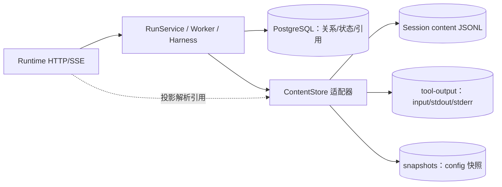

# PG + JSONL 存储方案详细设计

版本：v0.2；日期：2026-09-15；状态：已实现（DDL 与本地适配器），真实 PostgreSQL 迁移与并发验收未执行。

范围：把当前写入 PostgreSQL 的自管表正文内容（用户输入、模型回复、事件 payload、配置快照、待决回应）从数据库外置到用户根目录下的 JSONL/文件，使 PG 只保存关系、状态、序号、幂等、引用、digest 与长度。目标是满足"PG 单字段最长 4000 字符、不能裁剪、正文放文件存储"的约束，同时保持公共 HTTP/SSE 契约不变。

权威实现来源：`src/code_forge/runtime/app.py`、`src/code_forge/persistence/sqlite_store.py`、`src/code_forge/workspace/store.py`、`src/code_forge/harness/`、`src/code_forge/transport/server.py`。关系与事务基线：`docs/database.md`、`db/migrations/001_runtime.sql`。数据落点基线：`docs/agent-data-lifecycle.md`。

> 本文件是设计变更提案。按 `AGENTS.md`，表结构、事务与恢复语义变化必须先报告架构差异并同步规范与测试，确认前不得据此直接改代码或声称已可运行。

## 1. 目标与约束

| 约束 | 说明 |
| --- | --- |
| 单字段 ≤ 4000 字符 | 目标 PG 实例不存大文本，`text`/`jsonb` 正文列全部外置 |
| 不裁剪 | 正文必须完整保存，不能靠截断满足长度限制 |
| PG 尽量关系化 | 会话、Run、状态、序号、幂等、审计、引用、digest、长度 |
| 正文放文件 | 会话消息、事件 payload、快照、工具输入输出 |
| 契约稳定 | Platform 侧的 `Message.input/output`、SSE 事件 payload 字段名与结构不变 |
| 恢复可判定 | 引用必须可校验（digest + 长度）；缺失/损坏有明确失败语义 |

## 2. 现状问题（As-Is）

当前会话与历史正文在 DB 中重复保存，且多处无长度上界：

- `runs.input`：用户原文，DDL 允许 `1..100000`（`db/migrations/001_runtime.sql:95`）。
- `runs.output`：助手最终回复全文，`text` 无上界（同文件 `:104`）。
- `runs.config_snapshot`：完整 `RunSnapshot` JSON，Skill 多时增长（`:98`）。
- `run_events.data`：`message.delta.text`、`message.completed.text`、`tool.prepared.input`（整段代码）、`tool.output.text`（分片 ≤4096B，可 >4000）、`run.accepted.snapshot`（`:222`）。
- `pending_responses.payload/response_payload`：预留，未写入（`:199,:202`）。
- `sessions.title`、`external_ref` 等标量无界。

同一份 assistant 文本同时存在于 `runs.output`、`message.completed` 事件和 `transcript-*.jsonl`；工具代码/输出同时存在于事件与 `tool-output/.../input.txt`、`stdout.log`。下一轮历史由 `runs.input/output` 重组（`sqlite_store.py:1328`、`langgraph_harness.py:155`）。

## 3. 目标存储架构



分层规则：

- PostgreSQL 保存信封事实：Session、Run、Attempt、工具账本、事件信封（`event_id/seq/session_seq/type/occurred_at`）、`*_ref`、`*_digest`、`*_bytes/*_chars`、状态、审计。
- ContentStore（`persistence/content_store.py`）保存正文：事件 payload 追加进 Session content JSONL；消息正文与配置快照落不可变对象文件；工具输入输出仍落 `tool-output/`。
- 适配器在读写时透明解析引用：`get_run`/`list_events`/`get_snapshot`/`conversation_history` 返回的仍是完整文本，因此 `contracts.py` DTO 与 OpenAPI 公共 schema 不变。
- Core（`contracts/state_machine/service/ports/audit`）不依赖 ContentStore 具体实现，只在 `ports.py` 增加 `ContentStorePort` 声明。

## 4. 内容存储设计

### 4.1 目录布局（已实现）

```text
<base>/                                  # 绑定模式=user_path；legacy=state.db 所在目录
  sessions/<session_id>/
    session.json                         # 会话元数据投影（沿用）
    content-000001.jsonl                 # 权威事件正文日志，按 session_seq 追加
    messages/<run_id>-user.json          # 用户输入正文（不可变对象）
    messages/<run_id>-assistant.json     # 助手最终回复正文（不可变对象）
    snapshots/<run_id>.json              # 该 Run 的不可变 config_snapshot
    pending/<pending_id>-payload.json    # 待决请求正文（预留写入）
    pending/<pending_id>-response.json   # 已确认回应正文
    transcript-000001.jsonl              # 派生投影：仅 user/assistant，可重建，不作恢复事实
  tool-output/<session_id>/<run_id>/<operation_id>/
    input.txt / stdout.log / stderr.log  # 执行侧产物与诊断（沿用）
```

- 绑定模式的 `base` 为 `user_path`，与现有 User Root 布局一致；legacy 模式为 `state.db` 所在目录，便于本地开发与迁移。
- Session content JSONL 按文件大小轮转（单文件上限 8 MiB），记录以 `(ref, offset, bytes, digest)` 定位。
- `transcript-*.jsonl` 仍由 Runtime 作为面向用户的投影写入，不作为恢复事实；恢复以 `runs.*_ref` 与 content JSONL 为准。
- 消息与快照使用不可变对象文件而非 JSONL：一个 Run 的输入/回复读取无需 offset，且天然不重复追加。

### 4.2 事件 content JSONL 记录 schema（v1）

```json
{
  "schema_version": "1",
  "record_id": "<uuid，= 事件 event_id>",
  "session_id": "<uuid>",
  "run_id": "<uuid>",
  "run_seq": 3,
  "session_seq": 12,
  "kind": "event",
  "type": "<内部 EventType>",
  "occurred_at": "<RFC3339>",
  "actor_ref": "system:runtime/worker",
  "data": { "完整 payload，不做截断" }
}
```

- 内容寻址与校验：PG 的 `data_digest` 为整条记录规范 JSON 的 SHA-256，读取时重新计算比对。
- 追加写：单写者（Session 内写入序列化）追加并 `fsync`，再提交引用它的 PG 事务。
- 定位：PG 保存 `data_ref`（相对 base 的逻辑路径）+ `data_offset` + `data_bytes`，读取按偏移直接 seek，不线性扫描；轮转不影响定位。
- 消息对象 schema：`{schema_version,session_id,run_id,run_seq,role,content}`；`runs.input_digest`/`output_digest` 为该对象文件字节的 SHA-256，`input_chars`/`output_chars` 为 `content` 字符数。

### 4.3 引用 DTO（内部，不进公开契约）

```text
ContentRef { ref: str, offset: int, bytes: int, digest: str }
SnapshotRef { ref: str, bytes: int, digest: str }   # 单个不可变文件，无 offset
```

## 5. PG DDL 目标变化

对 `db/migrations/001_runtime.sql`（当前未部署，可直接修订；已部署环境追加 `002_*` 回填迁移）：

### runs

```sql
-- 移除 input text NOT NULL CHECK(length(input) BETWEEN 1 AND 100000)
input_ref text NOT NULL,
input_digest char(64) NOT NULL,
input_chars integer NOT NULL CHECK (input_chars > 0),
-- 移除 output text
output_ref text,
output_digest char(64),
output_chars integer CHECK (output_chars IS NULL OR output_chars > 0),
-- 移除 config_snapshot jsonb NOT NULL
config_snapshot_ref text NOT NULL,
config_snapshot_digest char(64) NOT NULL,
config_snapshot_bytes integer NOT NULL CHECK (config_snapshot_bytes > 0),
CHECK ((output_ref IS NULL) = (output_digest IS NULL)
       AND (output_ref IS NULL) = (output_chars IS NULL)),
CHECK (octet_length(execution_context::text) <= 4000),
CHECK (error IS NULL OR octet_length(error::text) <= 4000)
```

### run_events

```sql
-- 移除 data jsonb NOT NULL
data_ref text NOT NULL,
data_offset bigint NOT NULL CHECK (data_offset >= 0),
data_bytes integer NOT NULL CHECK (data_bytes > 0),
data_digest char(64) NOT NULL
```

### tool_executions

```sql
-- input_ref 保留（已是引用），补长度与摘要
input_digest char(64),
input_bytes integer CHECK (input_bytes IS NULL OR input_bytes > 0),
CHECK (error IS NULL OR octet_length(error::text) <= 4000),
CHECK (process_ref IS NULL OR octet_length(process_ref::text) <= 4000)
```

### pending_responses

```sql
-- 移除 payload jsonb NOT NULL / response_payload jsonb
payload_ref text NOT NULL,
payload_digest char(64) NOT NULL,
payload_bytes integer NOT NULL CHECK (payload_bytes > 0),
response_payload_ref text,
response_payload_digest char(64),
response_payload_bytes integer CHECK (response_payload_bytes IS NULL OR response_payload_bytes > 0)
```

### sessions 与其余标量

- `sessions.title`：`varchar(200) NOT NULL DEFAULT 'New session'`。
- `sessions.external_ref`、`runs.agent_ref`、`runs.wait_reason`、`tool_executions.tool_ref`、`tool_executions.execution_profile_ref`：改 `varchar(200)` 或加 `CHECK (length(col) <= 4000)`，按字段语义择一。
- 所有保留 `text` 的引用/路径列（`storage_ref`、`*_path`、`manifest_ref`、`result_ref`、`external_operation_ref` 等）统一加 `CHECK (length(col) <= 4000)`，作为目标库硬约束。

约束遵守：表数仍为 10；索引仍为 6 条主键/普通/唯一 B-tree；每张表与每个字段补 `COMMENT ON`；四审计字段保留。新增列必须同时补 COMMENT，否则 `tests/test_architecture_rules.py` 失败。

## 6. 内部端口与事务边界

### 6.1 新端口 `ContentStorePort`（`src/code_forge/ports.py`）

```text
append_record(user_binding, session_id, record) -> ContentRef
read_record(user_binding, ref) -> dict
read_records(user_binding, session_id, after_session_seq, limit) -> list[dict]
put_object(user_binding, kind, key, content: bytes) -> SnapshotRef
read_object(user_binding, ref) -> bytes
```

`RuntimeStorePort` 方法签名保持不变，由适配器组合 ContentStore：写入前先落内容，读接口透明回填文本，调用方无感。

### 6.2 写入顺序（统一规则）

1. 生成稳定 `record_id` / `event_id`。
2. 追加 content 记录并 `fsync`（外部副作用先落）。
3. 在 PG 事务内插入/更新信封、引用、序号、状态与审计，提交。
4. 事务提交后才允许 SSE 发布或返回。

失败语义：步骤 2 成功、步骤 3 失败 → 产生无引用内容（孤儿），PG 状态不变，重试重新生成新 `record_id`，旧孤儿延后由 GC 清理；绝不出现"PG 已承诺、内容不存在"的事件。步骤 2 失败 → 整个业务动作失败，不提交 PG。

### 6.3 各原子边界落点

- 接受 Run：`accept_once` 先写 user 消息内容与 config 快照对象，再在单事务插入 `runs`（ref/digest/chars）+ `run.accepted` 事件（data 引用快照）+ Session 序号。
- 领取/状态：`claim_next_run`、`transition_run` 解析 config 快照与 output 引用；`state_version` CAS 不变。
- 工具：`prepare_tool` 写 tool_input 内容（同时保留 `input.txt`），`append_tool_output` 写 event 内容；账本引用与状态更新仍在事务内。
- 完成：最终 `output` 写 content 记录，与 `task_outcome`、终态、`run.finished`、Attempt 结束同事务提交。
- 回应：`pending_responses` 的 payload/response_payload 走引用列。

## 7. 投影、SSE 与历史

- 事件投影：`transport/server.py` 的 `_event_view` 继续消费适配器解析后的 `event["data"]`，`message.delta/completed.text`、`tool.prepared.data.input` 等公开字段名与含义不变。
- SSE 回放：按 `run_events.session_seq` 读取信封 → 逐个解析 content → 投影；不改变公开 `seq` 与事件类型。
- 多轮历史：`conversation_history` 仍按 `run_seq < before` 取历史 Run 的 input/output 文本（由 content 引用解析），不依赖 LangGraph checkpoint。
- 无模型/隐藏推理仍不落库；`ContentStore` 不保存凭据。

## 8. 恢复语义与一致性

| 事实 | 来源 | 校验 |
| --- | --- | --- |
| 提交过什么 / 模型回复 | `runs.*_ref` → content JSONL | 重新计算 digest 与 `*_digest` 比对 |
| 事件回放 | `run_events` 信封 + `data_ref` | digest + bytes 比对 |
| 事件游标 | `sessions.next_event_seq` / `run_events.session_seq` | 不变 |
| 工具输入输出 | 账本引用 + content / `tool-output` | digest + revision |
| 配置快照 | run_events 中的 SnapshotRef 或 `runs.config_snapshot_ref` | digest 比对 |

- 引用缺失或 digest 不符：`ContentUnavailable` 在适配器边界映射为 `DomainError(DEPENDENCY_UNAVAILABLE)`（HTTP 5001），不静默用空串冒充。
- GC：扫描 Session content 日志与 PG 引用，回收无引用记录（崩溃孤儿）与无内容引用（悬空）；GC 必须可审计，不删除被 PG 引用的事实。当前尚未实现 GC。
- 恢复顺序仍为：先读 PG 状态/租约/epoch，再核验内容引用；不因读文件而放宽 fenced 写入规则。

## 9. 迁移

- `001_runtime.sql`（未部署）：已直接修订字段、CHECK 与 COMMENT，新增列一次性到位。
- 本地 SQLite：已实现 `_migrate_v4_to_v5`，`SCHEMA_VERSION=5`，v1/v2/v3 迁移链先升到 v4 再外置；既有 `input/output/config_snapshot/data/payload` 抽取为 content 文件后删除旧列。
- 已部署 PostgreSQL 环境：仍需追加 `002_content_externalization.sql`：先加可空新列 → 应用侧迁移器抽取正文并回填 `ref/offset/bytes/digest` → 置 NOT NULL → 删除旧正文列 → 补 CHECK/COMMENT。
- 迁移可回滚到"内容已写、引用未提交"的中间态；回填失败不删除旧列。

## 10. 测试

- 已更新静态规则：`tests/test_architecture_rules.py::test_postgres_stores_references_not_large_bodies` 断言不存在承载正文的 `text/jsonb` 列、`jsonb` 仅限 `execution_context/process_ref/error/provenance`、引用列齐全；仍 10 表/6 索引。
- 已通过：`PYTHONPATH=src .venv/bin/python -m unittest discover -s tests`（含接受、工具执行、SSE 回放、多轮历史、SQLite v1→v5 迁移）。
- 尚未新增/执行：`tests/integration/` 的真 PostgreSQL 迁移与并发、content 追加/轮转/offset 定位、写内容后 PG 失败产生孤儿且可 GC、引用缺失映射 5001 的专测。
- 公共 OpenAPI 不变，`scripts/export_contracts.py` 重新生成后应无差异；新增/改动用例后需跑 `scripts/export_workflow_cases.py`。
- 关联流程用例（`docs/testing/agent-workflow-cases.json`，保留 B 编号规则）：B07 持久接受、B11 新 Run 组装、B18/B26 工具输入与执行、B30 输出溢出与存储失败、B34 终态提交中断、B41/B42 流式与游标、B44 多轮历史；后续补"正文在 JSONL、PG 仅引用"的断言。
- 运行：`PYTHONPATH=src python3 -m unittest discover -s tests -v`；契约生成 `PYTHONPATH=src python3 scripts/export_contracts.py`。

## 11. 影响文件清单

| 类别 | 文件 | 状态 |
| --- | --- | --- |
| DDL/迁移 | `db/migrations/001_runtime.sql`、`tests/test_architecture_rules.py` | 已改 |
| 核心端口 | `src/code_forge/ports.py`（ContentStorePort） | 已改 |
| 适配器 | 新 `src/code_forge/persistence/content_store.py`、`persistence/sqlite_store.py` | 已改 |
| 已确认无需改动 | `workspace/store.py`、`runtime/app.py`、`harness/*`、`transport/server.py`（原样消费解析后的文本/事件） | 未改 |
| 待补 | PostgreSQL `002_*.sql`、`tests/integration/`、`docs/database.md`、`docs/agent-data-lifecycle.md` 的下游细节 | 进行中 |

## 12. 决策记录与后续

已按推荐项实现并落地：

1. 事件正文用统一 Session content JSONL；消息正文与快照用不可变对象文件；`transcript-*.jsonl` 保留为面向用户的投影。
2. `config_snapshot` 一律外置为不可变文件，保持单一规则。
3. 引用缺失复用 `DEPENDENCY_UNAVAILABLE`，不新增核心枚举，避免改动 OpenAPI 错误映射。
4. 工具输出在 content 事件日志与 `tool-output/` 各存一份（回放权威 = content 日志，执行诊断 = 文件）。

仍未完成、需真实环境验证：

- PostgreSQL 迁移执行与并发验收（当前仅有 SQLite 适配器测试）。
- 无引用内容（崩溃孤儿）与悬空引用的 GC 与审计。
- LangGraph 持久 Checkpointer 与 content 引用的共同恢复语义（当前仍为 `MemorySaver`）。
5. 现有 `001` 直接修订生效，与追加 `002` 回填迁移是否并行提供。

确认以上后，按第 9~11 节实现并同步规范与用例；未确认前不改动代码。
